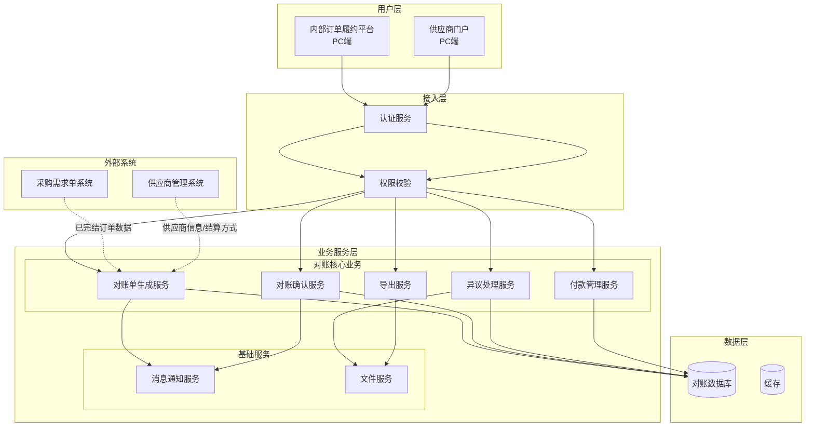
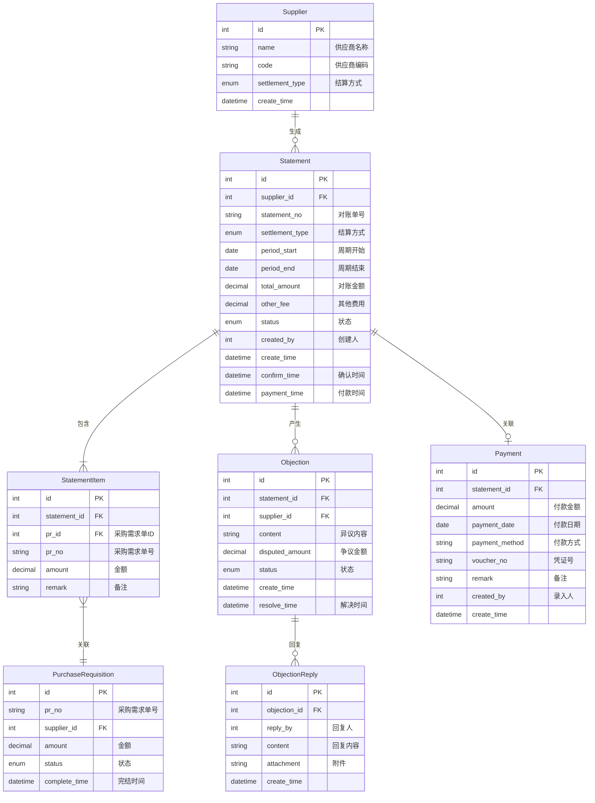
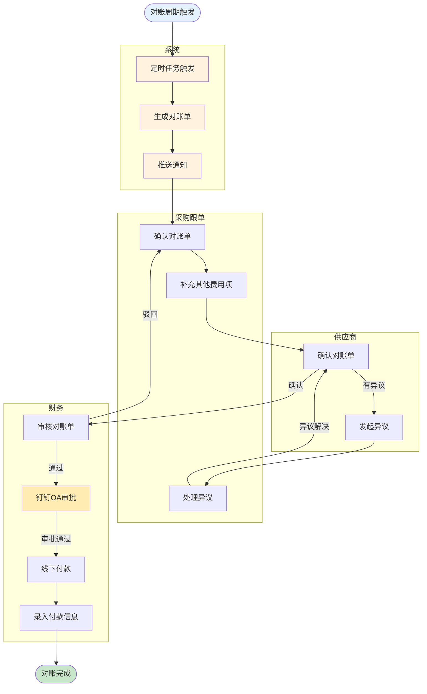
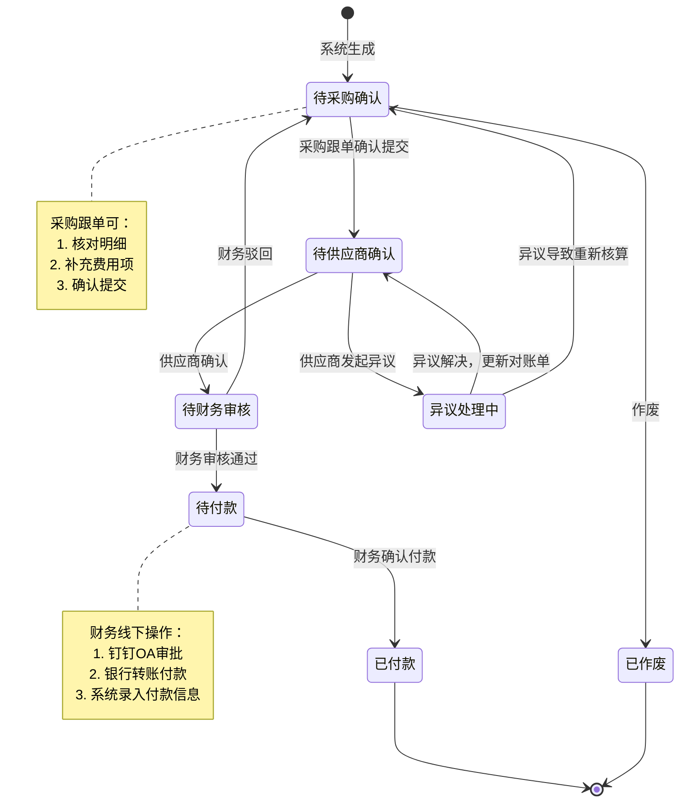
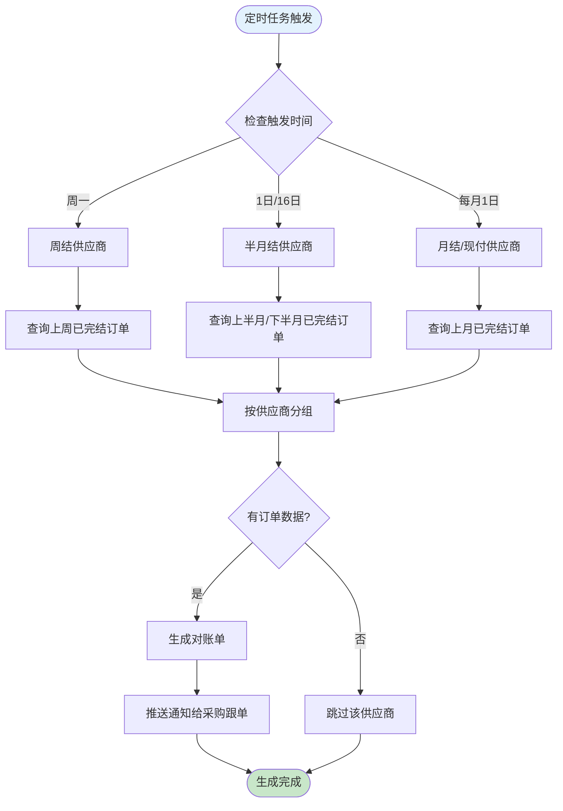

# 供应商财务对账系统 PRD

| PRD 审核人 | [待填写] |
| --- | --- |
| 重要性 | 高 |
| 紧迫性 | 中 |
| 需求方 | 财务部门 / 采购部门 |
| PRD 编写人 | [待填写] |
| PRD 提交日期 | 2026-04-27 |

## PRD 修改记录

| 变更时间 | 变更内容 | 变更提出部门与理由 | 修改人 | 审核人 | 版本号 |
| --- | --- | --- | --- | --- | --- |
| 2026-04-27 | 初始版本 | — | — | [待填写] | v1.0 |

---

## 1、项目背景

### 1.1 业务现状

企业在采购业务中，需要与供应商进行定期的财务对账和结算。当前对账业务涉及三方角色：
- **采购跟单**：负责确认对账单、补充费用项、处理异议
- **供应商**：确认对账单或发起异议
- **财务**：审核对账单、执行付款

供应商存在多种结算方式（现付、周结、半月结、月结），对账周期不一。对账数据来源于采购需求单，需筛选已完结状态的订单进行汇总。

**现有系统**：
- 订单履约平台：管理采购订单全流程
- 供应商门户：供应商查看订单信息

**业务规模**：
- 合作供应商数量：50+
- 有动销的供应商数量较少，整体对账量级不大

### 1.2 面临问题

1. **对账效率低**：对账单依赖人工统计，多结算周期混杂，容易遗漏或重复统计
2. **协同成本高**：采购跟单、供应商、财务三方通过线下方式（邮件、微信）沟通对账，信息传递不及时、易出错
3. **异议处理不透明**：供应商发起异议后，处理过程缺乏系统记录，难以追溯
4. **付款状态不清晰**：付款为线下行为，系统缺乏付款信息的记录和状态同步，财务和供应商无法实时了解付款进度
5. **数据一致性风险**：对账数据分散，缺乏统一的数据源和版本管理

### 1.3 解决思路

建立自动化的供应商财务对账系统：
- 根据供应商结算方式，系统自动按周期生成对账单
- 采购跟单、供应商、财务三方在线协作完成对账确认、异议处理、审核付款流程
- 付款行为线下执行，系统记录付款信息和状态变更，实现状态可视化

### 1.4 决策依据

- 供应商数量：50+（有动销的较少）
- 整体对账量级不大
- 当前对账流程线下化程度高，急需线上化提升效率

---

## 2、需求基本情况

| 要素 | 内容 |
| --- | --- |
| **需求提出人** | 财务部门 / 采购部门 |
| **功能使用人** | 采购跟单、供应商、财务 |
| **受影响人** | 采购经理、供应商管理团队 |
| **场景描述** | 见下方详细场景 |
| **发生频率** | 高频（周结/半月结/月结按周期触发，现付按月归集） |
| **核心痛点** | 解决对账流程自动化程度低、多方协作效率低、付款状态不透明的问题 |
| **需求价值** | 提升对账效率、降低沟通成本、增强数据透明度、规范财务流程 |

### 核心场景描述

> 💡 场景六要素：人物、时间、地点、起因、经过、结果

**场景1：对账单自动生成**

- **人物**：系统定时任务
- **时间**：根据结算周期自动触发（周结每周一、半月结每月1日/16日、月结/现付每月1日）
- **地点**：订单履约平台（后台服务）
- **起因**：到达对账周期，需要汇总该周期内已完结的采购需求单
- **经过**：系统筛选符合条件的数据，按供应商自动生成对账单，推送至采购跟单待办
- **结果**：对账单生成成功，状态为"待采购确认"

**场景2：采购跟单确认对账单**

- **人物**：采购跟单员张三
- **时间**：收到对账单待办通知后
- **地点**：内部订单履约平台PC端
- **起因**：需要对账单进行核对，可能需要补充其他费用项
- **经过**：
  1. 查看对账单明细，核对订单数据
  2. 补充其他费用项（如运费、损耗费、扣款等）
  3. 确认无误后提交给供应商
- **结果**：对账单状态变更为"待供应商确认"，供应商收到通知

**场景3：供应商确认对账单**

- **人物**：供应商财务人员李四
- **时间**：收到对账单通知后
- **地点**：供应商门户PC端
- **起因**：需要核对并确认本周期内的对账金额
- **经过**：
  1. 登录供应商门户，查看对账单详情
  2. 核对订单明细和费用项
  3. 确认无误后点击"确认"
- **结果**：对账单状态变更为"待财务审核"，财务收到通知

**场景4：供应商发起异议**

- **人物**：供应商财务人员李四
- **时间**：核对对账单时发现金额有误
- **地点**：供应商门户PC端
- **起因**：对账单中某笔订单金额与实际不符
- **经过**：
  1. 在对账单详情页点击"发起异议"
  2. 填写异议原因、涉及订单、期望金额
  3. 上传证明材料（如发货单、签收单）
  4. 提交异议
- **结果**：对账单状态变更为"异议处理中"，采购跟单收到异议处理通知

**场景5：采购跟单处理异议**

- **人物**：采购跟单员张三
- **时间**：收到异议处理通知后
- **地点**：内部订单履约平台PC端
- **起因**：供应商对对账单发起异议
- **经过**：
  1. 查看异议详情和证明材料
  2. 与供应商沟通（线下/电话）
  3. 更新对账单数据或驳回异议
- **结果**：异议解决，对账单重新进入确认流程

**场景6：财务审核并确认付款**

- **人物**：财务人员王五
- **时间**：收到对账单待审核通知后
- **地点**：内部订单履约平台PC端
- **起因**：对账单已通过采购跟单和供应商确认，需要审核付款
- **经过**：
  1. 审核对账单金额、附件、费用项
  2. 审核通过（系统状态变更为"待付款"）
  3. 触发钉钉OA审批流程（线下）
  4. 钉钉审批通过后，线下执行付款（银行转账等）
  5. 在系统中录入付款信息（付款时间、金额、方式、凭证号）
  6. 确认付款完成
- **结果**：对账单状态变更为"已付款"，供应商可在门户查看付款信息

---

## 3、业务分析与系统调研

### 3.1 同类系统调研

| 调研对象 | 类型 | 核心能力 | 可借鉴点 | 局限性 |
| --- | --- | --- | --- | --- |
| 现有订单履约平台 | 内部 | 采购订单管理、订单状态流转 | 已有供应商、采购需求单数据，可作为对账数据源 | 缺少对账单管理、多方协作确认功能 |
| 现有供应商门户 | 内部 | 供应商查看订单信息 | 已有供应商登录入口和基础信息 | 缺少对账确认、异议发起功能 |

### 3.2 业务痛点优先级

| 排序 | 痛点描述 | 影响范围 | 严重程度 | 紧迫度 | 涉及部门 |
| --- | --- | --- | --- | --- | --- |
| 1 | 对账单手工统计效率低、易出错 | 全部供应商 | 高 | 高 | 财务、采购 |
| 2 | 三方协作沟通成本高、信息不透明 | 全部对账流程 | 高 | 高 | 财务、采购、供应商 |
| 3 | 异议处理缺乏系统记录、难以追溯 | 有异议的对账单 | 中 | 中 | 采购、供应商 |
| 4 | 付款状态不可见、供应商需线下询问 | 全部付款 | 中 | 中 | 财务、供应商 |
| 5 | 多结算周期管理混乱 | 多结算方式供应商 | 中 | 低 | 财务、采购 |

### 3.3 投入产出初步评估

| 维度 | 估算 |
| --- | --- |
| **预计投入** | 由技术团队评估 |
| **效率提升** | 对账流程线上化，减少人工统计和沟通成本 |
| **业务价值** | 降低对账错误率，提升供应商满意度，规范财务付款流程 |

---

## 4、项目收益目标

### 4.1 项目目标

| 目标类型 | 目标描述 | 衡量指标 | 目标值 | 达成时限 |
| --- | --- | --- | --- | --- |
| **核心业务目标** | 实现对账流程线上化、自动化 | 对账单线上处理率 | 100% | 上线后1个月 |
| **效率目标** | 缩短对账周期 | 对账平均耗时 | 显著缩短 | 上线后3个月 |
| **体验目标** | 提升供应商满意度 | 供应商满意度评分 | 提升 | 上线后6个月 |

### 4.2 验收标准

1. 系统能根据供应商结算方式自动生成对账单
2. 采购跟单可在订单履约平台确认对账单、补充费用项、处理异议
3. 供应商可在供应商门户确认对账单、发起异议、查看付款信息
4. 财务可在订单履约平台审核对账单、录入付款信息
5. 支持现付、周结、半月结、月结四种结算周期
6. 现付订单按月度归集生成对账单
7. 支持对账单导出（订单履约平台 + 供应商门户）

### 4.3 成功标准

> 项目上线后 3 个月内，达到以下指标视为成功：

1. 对账单线上处理率达到 100%
2. 对账异议处理可追溯
3. 供应商付款信息查询不再依赖线下询问

---

## 5、项目方案概述

### 5.1 核心功能概述

本项目包含以下核心功能模块：

| 序号 | 功能模块 | 功能简述 | 优先级 |
| --- | --- | --- | --- |
| 1 | 对账单自动生成 | 根据供应商结算周期自动生成对账单 | P0 |
| 2 | 采购跟单对账管理 | 确认对账单、补充费用项、处理异议 | P0 |
| 3 | 供应商对账管理 | 确认对账单、发起异议、查看付款信息 | P0 |
| 4 | 财务对账管理 | 审核对账单、录入付款信息 | P0 |
| 5 | 异议处理管理 | 异议发起、处理、记录 | P1 |
| 6 | 付款信息管理 | 付款信息录入、查询、状态同步 | P1 |
| 7 | 对账单查询导出 | 对账单列表、详情、导出 | P1 |

### 5.2 方案概述

- **产品方案**：建立供应商财务对账系统，覆盖对账单生成→确认→审核→付款全流程，支持采购跟单、供应商、财务三方在线协作
- **技术方案**：复用现有订单履约平台和供应商门户，扩展对账管理模块；对账单数据来源于采购需求单
- **运营方案**：分阶段上线，先试点少量供应商，验证流程后全面推广

### 5.3 MVP 范围

> 💡 B端 MVP 原则：必须支撑核心业务流程闭环，不是"最简单的版本"

**MVP 包含的功能：**
- 对账单自动生成（支持四种结算周期）
- 采购跟单确认对账单、补充费用项
- 供应商确认对账单
- 财务审核对账单、录入付款信息
- 基础异议处理
- 对账单导出功能（订单履约平台 + 供应商门户，仅Excel格式）

**MVP 暂不包含的功能：**
- 对账统计分析报表（延后至V1.1）
- 异议处理的历史记录查询（延后至V1.1）

**核心验证假设：**
1. 自动生成对账单能准确汇总已完结采购需求单
2. 三方在线协作流程能显著提升对账效率
3. 供应商愿意在供应商门户进行对账确认

---

## 6、项目范围

### 6.1 涉及系统

| 系统名称 | 关系类型 | 影响描述 | 责任方 |
| --- | --- | --- | --- |
| 订单履约平台 | 主体改造 | 新增对账管理模块、付款管理模块 | 产品团队 |
| 供应商门户 | 主体改造 | 新增对账确认、异议发起、付款信息查看、导出功能 | 产品团队 |
| 采购需求单系统 | 数据来源 | 提供已完结订单数据 | [需确认] |
| 供应商管理系统 | 数据来源 | 提供供应商信息、结算方式 | [需确认] |

### 6.2 影响范围

- **用户影响**：采购跟单、财务人员需学习新流程；供应商需在供应商门户完成对账确认
- **流程影响**：对账流程从线下转为线上，付款记录方式变更
- **数据影响**：需确认采购需求单数据字段是否满足对账需求
- **上下游影响**：无需与其他系统对接

### 6.3 不在本期范围内

1. **结算单管理**：对账确认后直接付款，无需独立结算单模块
2. **钉钉OA审批对接**：审批流程线下完成，系统不体现
3. **分批付款**：不支持一个对账单分批付款
4. **自动付款对接**：付款仍为线下行为，不与银行系统对接
5. **发票管理**：发票相关功能不在本期范围

---

## 7、项目风险

### 7.1 前提假设

| 编号 | 假设内容 | 如果假设不成立的影响 |
| --- | --- | --- |
| A1 | 采购需求单状态"已完结"可准确识别 | 对账单数据不准确 |
| A2 | 供应商愿意使用供应商门户进行对账 | 供应商仍采用线下确认，系统价值降低 |
| A3 | 供应商结算方式数据准确完整 | 对账单生成周期错误 |

### 7.2 约束条件

| 编号 | 约束描述 | 对设计的影响 |
| --- | --- | --- |
| C1 | 付款为线下行为 | 系统仅记录付款信息，不执行实际付款 |
| C2 | 复用现有订单履约平台和供应商门户 | 需在现有系统架构上扩展，遵循现有技术栈 |
| C3 | 供应商门户需支持供应商自主操作 | 需设计简洁易用的操作流程 |
| C4 | 钉钉OA审批线下完成 | 系统不体现审批流程，仅记录最终付款状态 |

### 7.3 风险清单

| 编号 | 风险类别 | 风险描述 | 发生概率 | 影响程度 | 应对方案 |
| --- | --- | --- | --- | --- | --- |
| R1 | 产品风险 | 采购需求单数据不完整或状态不准 | 中 | 高 | 上线前进行数据清洗和校验，建立数据质量监控 |
| R2 | 运营风险 | 供应商不习惯使用线上对账 | 中 | 中 | 提供操作指南和培训，设置过渡期支持线下确认 |
| R3 | 技术风险 | 定时任务生成对账单时数据量过大 | 低 | 中 | 采用分批处理机制，设置执行时间窗口 |
| R4 | 产品风险 | 异议处理流程过于复杂 | 低 | 低 | 设计简洁的异议流程，支持快速沟通解决 |

---

## 8、术语和缩略语

| 术语/缩略语 | 全称 | 定义说明 |
| --- | --- | --- |
| 对账单 | Statement | 汇总一定周期内供应商已完成订单的财务单据 |
| 结算方式 | Settlement Type | 供应商的付款周期类型，包括现付、周结、半月结、月结 |
| 现付 | Cash on Delivery | 订单完成后立即付款，对账单按月归集 |
| 周结 | Weekly Settlement | 按周结算，每周生成对账单 |
| 半月结 | Semi-monthly Settlement | 按半月结算，每月1日和16日生成对账单 |
| 月结 | Monthly Settlement | 按月结算，每月初生成上月对账单 |
| 异议 | Objection | 供应商对对账单内容有疑问时提出的申诉 |
| 采购需求单 | Purchase Requisition | 采购订单，状态为"已完结"的作为对账数据源 |

> 注：尽量不要自己定义缩略语。如涉及公司内部缩略语，请明确其定义。

## 9、参考文献和引用文档

| 文档名称 | 版本 | 链接/位置 | 说明 |
| --- | --- | --- | --- |
| 供应商财务对账系统PRD | V1.0 | 本文档 | |

> 注：对账数据来源于采购需求单、供应商信息来源于供应商管理系统，均为内部系统直接查询数据库，无需接口文档。

---

## 10、功能需求

### 10.1 产品框架概述

#### 10.1.1 应用架构图

#### 10.1.2 数据模型图

**实体说明：**

| 实体 | 说明 | 关键属性 |
|------|------|---------|
| Supplier | 供应商 | 结算方式决定对账周期 |
| Statement | 对账单 | 核心业务实体，状态驱动流程 |
| StatementItem | 对账单明细 | 关联采购需求单 |
| PurchaseRequisition | 采购需求单 | 数据来源，已完结状态 |
| Objection | 异议记录 | 供应商发起，采购跟单处理 |
| ObjectionReply | 异议回复 | 异议处理沟通记录 |
| Payment | 付款记录 | 财务线下付款后录入 |

#### 10.1.3 核心业务流程图

#### 10.1.4 状态机图

**状态转换明细表：**

| 当前状态 | 触发事件 | 目标状态 | 操作角色 | 备注 |
|---------|---------|---------|---------|------|
| — | 系统生成 | 待采购确认 | 系统 | 定时任务触发 |
| 待采购确认 | 采购跟单确认 | 待供应商确认 | 采购跟单 | 可补充费用项后确认 |
| 待采购确认 | 作废 | 已作废 | 采购跟单/财务 | 无订单数据时 |
| 待供应商确认 | 供应商确认 | 待财务审核 | 供应商 | — |
| 待供应商确认 | 发起异议 | 异议处理中 | 供应商 | — |
| 异议处理中 | 异议解决 | 待供应商确认 | 采购跟单 | 更新对账单后重新确认 |
| 异议处理中 | 重新核算 | 待采购确认 | 采购跟单 | 异议导致数据变更 |
| 待财务审核 | 审核通过 | 待付款 | 财务 | 触发钉钉OA审批（线下） |
| 待财务审核 | 驳回 | 待采购确认 | 财务 | 说明驳回原因 |
| 待付款 | 确认付款 | 已付款 | 财务 | 录入付款信息 |
| 已付款 | — | — | — | 终态 |

#### 10.1.5 功能清单

| 子系统 | 页面 | PC端 | 供应商门户 | 说明 |
| --- | --- | --- | --- | --- |
| 对账单管理 | 对账单列表 | ✓ | ✓ | 查询、筛选、导出 |
| 对账单管理 | 对账单详情 | ✓ | ✓ | 查看明细、操作确认/异议、导出 |
| 对账单管理 | 对账单生成 | ✓ | — | 手动触发生成（管理员） |
| 费用管理 | 费用项维护 | ✓ | — | 采购跟单补充其他费用 |
| 异议管理 | 异议发起 | — | ✓ | 供应商发起异议 |
| 异议管理 | 异议处理 | ✓ | — | 采购跟单处理异议 |
| 异议管理 | 异议记录 | ✓ | ✓ | 查看异议处理历史 |
| 付款管理 | 付款录入 | ✓ | — | 财务录入付款信息 |
| 付款管理 | 付款查询 | ✓ | ✓ | 查看付款信息 |

---

### 10.2 产品需求详解

#### 10.2.1 对账单自动生成功能详解

##### 10.2.1.1 业务流程图

##### 10.2.1.2 对账单生成规则

| 结算方式 | 生成周期 | 生成时间 | 数据范围 | 说明 |
|---------|---------|---------|---------|------|
| 现付 | 月度 | 每月1日凌晨 | 上月1日00:00 至 上月最后一天23:59 的已完结订单 | 按月归集，方便财务统计 |
| 周结 | 周度 | 每周一凌晨 | 上周一00:00 至 上周日23:59 的已完结订单 | — |
| 半月结 | 半月度 | 每月1日、16日凌晨 | 上半月：上月16日至月末；下半月：本月1日至15日 | — |
| 月结 | 月度 | 每月1日凌晨 | 上月1日00:00 至 上月最后一天23:59 的已完结订单 | — |

##### 10.2.1.3 业务规则

| 编号 | 规则类型 | 规则描述 |
| --- | --- | --- |
| R1 | 触发条件 | 采购需求单状态为"已完结"时纳入对账范围 |
| R2 | 约束 | 同一采购需求单只能出现在一个对账单中 |
| R3 | 计算 | 对账单金额 = Σ(采购需求单金额) + 其他费用项金额 |
| R4 | 约束 | 对账单号生成规则：DZD + 年月日 + 供应商编码 + 序号 |
| R5 | 触发条件 | 对账单生成后自动推送消息通知采购跟单 |

##### 10.2.1.4 操作后置动作

| 操作 | 后置动作 |
|------|---------|
| 对账单自动生成 | ① 状态变更为"待采购确认" ② 推送站内消息通知采购跟单 ③ 推送钉钉消息通知采购跟单（如已配置） ④ 记录操作日志（系统自动） |

---

#### 10.2.2 采购跟单对账管理功能详解

##### 10.2.2.1 页面交互

**对账单列表页（订单履约平台）**

> 💡 设计原则：有用 > 高效 > 容错 > 启发

**查询条件：**

| 字段名称 | 默认值 | 字段类型 | 备注 |
| --- | --- | --- | --- |
| 对账单号 | 空 | 文本 | 支持模糊搜索 |
| 供应商名称 | 空 | 下拉搜索 | |
| 状态 | 全部 | 下拉 | 待采购确认、待供应商确认、异议处理中、待财务审核、待付款、已付款、已作废 |
| 结算方式 | 全部 | 下拉 | 现付、周结、半月结、月结 |
| 对账周期 | 空 | 日期范围 | |
| 创建时间 | 空 | 日期范围 | |

**列表字段：**

| 字段名称 | 默认值 | 字段类型 | 开放修改 | 必输项 | 备注 |
| --- | --- | --- | --- | --- | --- |
| 对账单号 | — | 文本 | 否 | — | 点击跳转详情 |
| 供应商名称 | — | 文本 | 否 | — | |
| 结算方式 | — | 标签 | 否 | — | 颜色区分 |
| 对账周期 | — | 日期范围 | 否 | — | |
| 订单金额 | — | 金额 | 否 | — | |
| 其他费用 | — | 金额 | 否 | — | 采购跟单补充后显示 |
| 对账金额 | — | 金额 | 否 | — | 订单金额+其他费用 |
| 状态 | — | 标签 | 否 | — | 颜色区分 |
| 创建时间 | — | 日期时间 | 否 | — | |
| 操作 | — | 按钮 | — | — | 根据状态显示不同操作 |

**操作按钮：**

| 按钮名称 | 操作说明 | 触发条件 | 权限要求 |
| --- | --- | --- | --- |
| 查看 | 跳转对账单详情页 | 所有状态 | 采购跟单 |
| 确认 | 跳转确认页面（可补充费用项） | 待采购确认 | 采购跟单 |
| 处理异议 | 跳转异议处理页面 | 异议处理中 | 采购跟单 |
| 导出 | 导出对账单列表 | 所有状态 | 采购跟单 |

**对账单详情页（采购跟单视角）**

**基本信息区：**
| 字段 | 说明 |
|------|------|
| 对账单号 | — |
| 供应商名称 | — |
| 结算方式 | — |
| 对账周期 | 起止日期 |
| 状态 | — |
| 创建时间 | — |

**订单明细区：**

| 字段名称 | 字段类型 | 备注 |
| --- | --- | --- |
| 采购需求单号 | 文本 | 点击可跳转查看原单据 |
| 订单金额 | 金额 | |
| 完结时间 | 日期时间 | |
| 备注 | 文本 | |

**其他费用区（可编辑）：**

| 字段名称 | 字段类型 | 开放修改 | 必输项 | 备注 |
| --- | --- | --- | --- | --- |
| 费用类型 | 下拉 | 是 | 是 | 运费、损耗费、扣款、其他 |
| 金额 | 数字 | 是 | 是 | 支持正负数 |
| 备注 | 文本 | 是 | 否 | |
| 操作 | 按钮 | — | — | 添加/删除 |

**操作按钮：**

| 按钮名称 | 操作说明 | 触发条件 | 权限要求 |
| --- | --- | --- | --- |
| 提交确认 | 确认对账单，状态流转至待供应商确认 | 待采购确认 | 采购跟单 |
| 作废 | 作废对账单 | 待采购确认（无订单数据时） | 采购跟单 |
| 导出 | 导出对账单详情 | 所有状态 | 采购跟单 |

##### 10.2.2.2 业务规则

| 编号 | 规则类型 | 规则描述 |
| --- | --- | --- |
| R1 | 约束 | 其他费用项金额支持正数（加收）和负数（扣款） |
| R2 | 计算 | 对账金额 = 订单金额合计 + 其他费用合计 |
| R3 | 触发条件 | 提交确认后自动推送消息通知供应商 |
| R4 | 约束 | 提交确认时必须至少有一条订单明细 |

##### 10.2.2.3 操作后置动作

| 操作 | 后置动作 |
|------|---------|
| 提交确认 | ① 状态变更为"待供应商确认" ② 记录采购跟单确认人和确认时间 ③ 推送站内消息通知供应商 ④ 推送钉钉消息通知供应商（如已配置） ⑤ 记录操作日志 |
| 作废对账单 | ① 状态变更为"已作废" ② 记录作废原因和操作人 ③ 记录操作日志 |
| 补充费用项 | ① 重新计算对账金额 ② 更新"其他费用"字段 ③ 记录操作日志（含费用项明细） |

---

#### 10.2.3 供应商对账管理功能详解

##### 10.2.3.1 页面交互

**对账单列表页（供应商门户）**

**查询条件：**

| 字段名称 | 默认值 | 字段类型 | 备注 |
| --- | --- | --- | --- |
| 对账单号 | 空 | 文本 | 支持模糊搜索 |
| 状态 | 全部 | 下拉 | 待供应商确认、异议处理中、待财务审核、待付款、已付款 |
| 对账周期 | 空 | 日期范围 | |

**列表字段：**

| 字段名称 | 字段类型 | 备注 |
| --- | --- | --- |
| 对账单号 | 文本 | 点击跳转详情 |
| 对账周期 | 日期范围 | |
| 订单金额 | 金额 | |
| 其他费用 | 金额 | |
| 对账金额 | 金额 | |
| 状态 | 标签 | 颜色区分 |
| 创建时间 | 日期时间 | |

**操作按钮：**

| 按钮名称 | 操作说明 | 触发条件 | 权限要求 |
| --- | --- | --- | --- |
| 查看 | 跳转对账单详情页 | 所有状态 | 供应商 |
| 确认 | 弹窗确认对账单 | 待供应商确认 | 供应商 |
| 发起异议 | 跳转异议发起页 | 待供应商确认 | 供应商 |

**对账单详情页（供应商视角）**

**基本信息区：** 显示对账单基本信息（只读）

**订单明细区：** 显示采购需求单明细（只读）

**其他费用区：** 显示费用项明细（只读）

**付款信息区（已付款状态显示）：**

| 字段名称 | 字段类型 | 备注 |
| --- | --- | --- |
| 付款金额 | 金额 | |
| 付款日期 | 日期 | |
| 付款方式 | 文本 | |
| 凭证号 | 文本 | |
| 备注 | 文本 | |

**操作按钮：**

| 按钮名称 | 操作说明 | 触发条件 | 权限要求 |
| --- | --- | --- | --- |
| 确认 | 弹窗确认，输入确认意见（选填） | 待供应商确认 | 供应商 |
| 发起异议 | 跳转异议发起页 | 待供应商确认 | 供应商 |
| 导出 | 导出对账单详情（Excel） | 所有状态 | 供应商 |

##### 10.2.3.2 异议发起页面

**异议表单：**

| 字段名称 | 字段类型 | 必输项 | 备注 |
| --- | --- | --- | --- |
| 异议类型 | 下拉 | 是 | 金额不符、订单缺失、费用异议、其他 |
| 涉及订单 | 多选 | 否 | 选择有问题的订单 |
| 争议金额 | 数字 | 是 | |
| 异议说明 | 多行文本 | 是 | 最多500字 |
| 证明材料 | 文件上传 | 否 | 支持图片、PDF |

##### 10.2.3.3 业务规则

| 编号 | 规则类型 | 规则描述 |
| --- | --- | --- |
| R1 | 触发条件 | 供应商确认后自动推送消息通知财务 |
| R2 | 触发条件 | 供应商发起异议后自动推送消息通知采购跟单 |
| R3 | 约束 | 异议说明字数限制500字 |
| R4 | 约束 | 证明材料支持jpg、png、pdf格式，单文件最大10MB |

##### 10.2.3.4 操作后置动作

| 操作 | 后置动作 |
|------|---------|
| 供应商确认 | ① 状态变更为"待财务审核" ② 记录供应商确认人和确认时间 ③ 推送站内消息通知财务 ④ 推送钉钉消息通知财务（如已配置） ⑤ 记录操作日志 |
| 发起异议 | ① 状态变更为"异议处理中" ② 生成异议记录（异议ID、异议类型、争议金额、异议说明） ③ 关联证明材料附件 ④ 推送站内消息通知采购跟单 ⑤ 推送钉钉消息通知采购跟单（如已配置） ⑥ 记录操作日志 |
| 导出对账单 | ① 记录导出操作日志（导出时间、导出人、导出内容） ② 生成Excel文件并下载 |

---

#### 10.2.4 财务对账管理功能详解

##### 10.2.4.1 页面交互

**对账单列表页（财务视角）**

**查询条件：** 同采购跟单，增加"付款状态"筛选

**操作按钮：**

| 按钮名称 | 操作说明 | 触发条件 | 权限要求 |
| --- | --- | --- | --- |
| 审核 | 跳转审核页面 | 待财务审核 | 财务 |
| 录入付款 | 跳转付款录入页面 | 待付款 | 财务 |
| 查看 | 跳转详情页 | 所有状态 | 财务 |
| 导出 | 导出对账单列表 | 所有状态 | 财务 |

**对账单审核页**

显示对账单完整信息，增加审核操作区：

| 字段名称 | 字段类型 | 必输项 | 备注 |
| --- | --- | --- | --- |
| 审核结果 | 单选 | 是 | 通过/驳回 |
| 审核意见 | 多行文本 | 驳回时必填 | 最多200字 |

**付款录入页面**

| 字段名称 | 字段类型 | 必输项 | 备注 |
| --- | --- | --- | --- |
| 付款金额 | 数字 | 是 | 默认为对账金额，可修改 |
| 付款日期 | 日期 | 是 | 默认当天 |
| 付款方式 | 下拉 | 是 | 银行转账、支票、现金、其他 |
| 凭证号 | 文本 | 否 | |
| 收款账户 | 文本 | 否 | |
| 备注 | 多行文本 | 否 | |

##### 10.2.4.2 业务规则

| 编号 | 规则类型 | 规则描述 |
| --- | --- | --- |
| R1 | 约束 | 审核驳回时必须填写驳回原因 |
| R2 | 触发条件 | 审核通过后状态变更为"待付款"，触发钉钉OA审批（线下流程） |
| R3 | 触发条件 | 付款确认后状态变更为"已付款"，推送消息通知供应商 |
| R4 | 约束 | 付款金额不能大于对账金额 |

##### 10.2.4.3 操作后置动作

| 操作 | 后置动作 |
|------|---------|
| 审核通过 | ① 状态变更为"待付款" ② 记录财务审核人和审核时间 ③ 记录审核意见（如有） ④ 触发钉钉OA审批流程（线下行为，系统不体现） ⑤ 记录操作日志 |
| 审核驳回 | ① 状态变更为"待采购确认" ② 记录财务审核人、审核时间、驳回原因 ③ 推送站内消息通知采购跟单 ④ 推送钉钉消息通知采购跟单（如已配置） ⑤ 记录操作日志 |
| 录入付款信息 | ① 状态变更为"已付款" ② 生成付款记录（付款金额、付款日期、付款方式、凭证号等） ③ 推送站内消息通知供应商 ④ 推送钉钉消息通知供应商（如已配置） ⑤ 推送站内消息通知采购跟单 ⑥ 记录操作日志 |
| 导出对账单 | ① 记录导出操作日志（导出时间、导出人、导出内容） ② 生成Excel文件并下载 |

---

#### 10.2.5 异议处理功能详解

##### 10.2.5.1 异议处理页面（采购跟单）

**异议信息区：** 显示供应商提交的异议内容

**异议回复区：**

| 字段名称 | 字段类型 | 必输项 | 备注 |
| --- | --- | --- | --- |
| 处理方式 | 单选 | 是 | 更新对账单/驳回异议 |
| 回复内容 | 多行文本 | 是 | 最多500字 |
| 附件 | 文件上传 | 否 | |

**操作按钮：**

| 按钮名称 | 操作说明 | 权限要求 |
| --- | --- | --- |
| 提交回复 | 提交异议处理结果 | 采购跟单 |

##### 10.2.5.2 业务规则

| 编号 | 规则类型 | 规则描述 |
| --- | --- | --- |
| R1 | 触发条件 | 更新对账单后，对账单状态流转至"待供应商确认"，供应商需重新确认 |
| R2 | 触发条件 | 驳回异议后，异议状态变更为"已驳回"，对账单状态流转至"待供应商确认" |
| R3 | 约束 | 异议处理记录需保留，支持追溯 |

##### 10.2.5.3 操作后置动作

| 操作 | 后置动作 |
|------|---------|
| 提交回复（更新对账单） | ① 异议状态变更为"已解决" ② 对账单状态变更为"待供应商确认" ③ 记录异议回复内容和回复人 ④ 更新对账单金额（如有调整） ⑤ 推送站内消息通知供应商 ⑥ 推送钉钉消息通知供应商（如已配置） ⑦ 记录操作日志 |
| 提交回复（驳回异议） | ① 异议状态变更为"已驳回" ② 对账单状态变更为"待供应商确认" ③ 记录异议回复内容、回复人、驳回理由 ④ 推送站内消息通知供应商 ⑤ 推送钉钉消息通知供应商（如已配置） ⑥ 记录操作日志 |

---

#### 10.2.6 对账单导出功能详解

##### 10.2.6.1 订单履约平台导出

**导出入口：** 对账单列表页、对账单详情页

**导出方式：**
- 支持单条导出和批量导出
- 导出格式：Excel（.xlsx）

**导出字段：**

| 字段名称 | 说明 |
|---------|------|
| 对账单号 | — |
| 供应商名称 | — |
| 供应商编码 | — |
| 结算方式 | — |
| 对账周期开始日期 | — |
| 对账周期结束日期 | — |
| 订单金额 | — |
| 其他费用 | — |
| 对账金额 | — |
| 状态 | — |
| 创建时间 | — |
| 采购跟单确认人 | — |
| 采购跟单确认时间 | — |
| 供应商确认时间 | — |
| 财务审核人 | — |
| 财务审核时间 | — |
| 付款金额 | — |
| 付款日期 | — |
| 付款方式 | — |
| 凭证号 | — |

**导出权限：** 采购跟单、财务

##### 10.2.6.2 供应商门户导出

**导出入口：** 对账单详情页

**导出方式：**
- 仅支持单条导出
- 导出格式：Excel（.xlsx）

**导出内容：** 对账单详情页完整信息（基本信息 + 订单明细 + 其他费用）

**导出权限：** 供应商

##### 10.2.6.3 业务规则

| 编号 | 规则类型 | 规则描述 |
| --- | --- | --- |
| R1 | 约束 | 批量导出最多支持100条 |
| R2 | 约束 | 导出文件命名规则：对账单导出_YYYYMMDD_HHMMSS.xlsx |
| R3 | 约束 | 导出数据仅包含当前用户有权限查看的对账单 |

##### 10.2.6.4 操作后置动作

| 操作 | 后置动作 |
|------|---------|
| 订单履约平台-单条导出 | ① 生成Excel文件 ② 浏览器下载文件 ③ 记录导出操作日志（导出时间、导出人、对账单号、导出类型=单条） |
| 订单履约平台-批量导出 | ① 校验导出数量（≤100条） ② 生成Excel文件（含多条对账单） ③ 浏览器下载文件 ④ 记录导出操作日志（导出时间、导出人、对账单号列表、导出类型=批量） |
| 供应商门户-导出 | ① 生成Excel文件 ② 浏览器下载文件 ③ 记录导出操作日志（导出时间、供应商ID、对账单号） |

---

### 10.3 异常情况处理方案

| 异常类型 | 异常场景 | 处理方案 |
| --- | --- | --- |
| 数据异常 | 对账单生成时无已完结订单 | 生成空对账单，状态标记为"待采购确认"，采购跟单可作废 |
| 数据异常 | 采购需求单状态变更 | 已纳入对账单的订单不支持状态回退；如需调整，采购跟单作废对账单后重新生成 |
| 业务异常 | 供应商长期未确认 | 系统设置超时提醒（3天/7天），支持采购跟单代确认（需备注说明） |
| 业务异常 | 异议长期未处理 | 系统设置超时提醒（3天），升级通知采购经理 |
| 并发冲突 | 多人同时编辑费用项 | 乐观锁控制，后提交者提示"数据已变更，请刷新后重试" |
| 网络异常 | 提交操作时断网 | 前端暂存表单数据，提示用户网络恢复后重新提交 |

---

## 11、数据埋点

> ⚠️ 本期暂不实施数据埋点，后续版本根据需要再规划。

### 11.1 埋点策略

- **埋点目标**：监控对账流程效率、功能使用率、异常率
- **埋点工具**：[后续确认]
- **实施计划**：延后至V1.1版本

### 11.2 预留埋点设计（供后续参考）

**页面埋点：**

| 页面名称 | 事件名称 | 事件类型 | 采集参数 | 用途说明 |
| --- | --- | --- | --- | --- |
| 对账单列表页 | statement_list_view | 页面曝光 | page_id, user_role | 监控页面使用率 |
| 对账单详情页 | statement_detail_view | 页面曝光 | statement_id, user_role | 监控对账单查看情况 |

**行为埋点：**

| 操作名称 | 事件名称 | 触发条件 | 采集参数 | 用途说明 |
| --- | --- | --- | --- | --- |
| 对账单生成 | statement_generated | 系统生成 | supplier_id, settlement_type, amount, order_count | 监控自动生成情况 |
| 采购跟单确认 | buyer_confirmed | 采购跟单提交 | statement_id, user_id, duration | 监控采购确认效率 |
| 供应商确认 | supplier_confirmed | 供应商确认 | statement_id, supplier_id, duration | 监控供应商确认效率 |
| 发起异议 | objection_raised | 供应商发起 | statement_id, objection_type, disputed_amount | 监控异议情况 |
| 异议解决 | objection_resolved | 采购跟单处理 | statement_id, resolution_type, duration | 监控异议处理效率 |
| 财务审核 | finance_approved | 财务审核通过 | statement_id, user_id | 监控财务审核 |
| 付款确认 | payment_confirmed | 财务确认付款 | statement_id, amount, payment_method | 监控付款情况 |
| 对账单导出 | statement_exported | 用户导出 | statement_id, user_role, export_type | 监控导出功能使用 |

**业务指标：**

| 指标名称 | 计算方式 | 数据来源 | 统计周期 |
| --- | --- | --- | --- |
| 日均对账单生成量 | count(statement.status!=已作废) | 对账单表 | 日 |
| 对账平均耗时 | avg(付款确认时间 - 生成时间) | 对账单表 | 周/月 |
| 异议率 | count(有异议的对账单) / count(总对账单) | 对账单表 | 月 |
| 异议平均处理时长 | avg(异议解决时间 - 异议发起时间) | 异议表 | 月 |

---

## 12、角色和权限

### 12.1 角色定义

| 角色名称 | 角色说明 | 典型人群 | 数据范围 |
| --- | --- | --- | --- |
| 采购跟单 | 确认对账单、补充费用、处理异议 | 采购部门员工 | 本人负责的供应商对账单 |
| 供应商 | 确认对账单、发起异议、查看付款 | 供应商财务人员 | 本供应商的对账单 |
| 财务 | 审核对账单、录入付款信息 | 财务部门员工 | 全部对账单 |
| 系统管理员 | 系统配置、异常处理 | IT人员 | 全部数据 |

### 12.2 功能权限矩阵

| 序号 | 一级导航 | 页面 | 页面元素 | 采购跟单 | 供应商 | 财务 |
| --- | --- | --- | --- | --- | --- | --- |
| 1 | 对账单管理 | 对账单列表 | — | ✓ | ✓ | ✓ |
| 2 | 对账单管理 | 对账单列表 | "确认"按钮 | ✓ | — | — |
| 3 | 对账单管理 | 对账单列表 | "审核"按钮 | — | — | ✓ |
| 4 | 对账单管理 | 对账单列表 | "录入付款"按钮 | — | — | ✓ |
| 5 | 对账单管理 | 对账单详情 | — | ✓ | ✓ | ✓ |
| 6 | 对账单管理 | 对账单详情 | "补充费用项"操作 | ✓ | — | — |
| 7 | 对账单管理 | 对账单详情 | "作废"按钮 | ✓ | — | ✓ |
| 8 | 对账单管理 | 对账单列表 | "导出"按钮 | ✓ | — | ✓ |
| 9 | 对账单管理 | 对账单详情 | "导出"按钮 | ✓ | ✓ | ✓ |
| 10 | 异议管理 | 异议发起 | — | — | ✓ | — |
| 11 | 异议管理 | 异议处理 | — | ✓ | — | — |
| 12 | 异议管理 | 异议记录 | — | ✓ | ✓ | ✓ |
| 13 | 付款管理 | 付款录入 | — | — | — | ✓ |
| 14 | 付款管理 | 付款查询 | — | — | ✓ | ✓ |

### 12.3 数据权限设计

> 💡 数据权限 = 谁能看到/操作哪些数据范围

| 角色 | 数据范围规则 | 说明 |
| --- | --- | --- |
| 采购跟单 | 本人负责的供应商对账单 | 根据供应商归属分配 |
| 供应商 | 本供应商的对账单 | 根据登录账号关联的供应商ID过滤 |
| 财务 | 全部数据 | 可查看和操作所有对账单 |

### 12.4 管理功能

- **用户管理**：创建/编辑/停用/启用用户账号（系统管理员）
- **角色管理**：创建/编辑/删除角色，配置权限集（系统管理员）
- **供应商账号管理**：为供应商创建登录账号（系统管理员/采购经理）

---

## 13、运营计划

### 13.1 上线发布计划

| 阶段 | 时间 | 范围 | 目标 | 回滚方案 |
| --- | --- | --- | --- | --- |
| 内测 | [待定] | 内部团队 | 基础功能验证 | 修复问题后继续 |
| 试点 | [待定] | 3-5家供应商 | 验证完整流程 | 回退线下对账 |
| 全面推广 | [待定] | 全部供应商 | 替换线下对账流程 | — |

### 13.2 培训计划

| 培训对象 | 培训内容 | 培训方式 | 培训时间 | 负责人 |
| --- | --- | --- | --- | --- |
| 采购跟单 | 对账确认、费用补充、异议处理 | 线下培训+操作手册 | [待定] | 产品团队 |
| 财务人员 | 对账审核、付款录入 | 线下培训+操作手册 | [待定] | 产品团队 |
| 供应商 | 对账确认、异议发起、导出 | 视频教程+在线帮助 | [待定] | 产品团队 |

### 13.3 推广与采纳

- **推广策略**：内部公告、操作培训、试点供应商案例分享
- **采纳率目标**：上线后1个月内，全部对账单通过系统完成
- **旧流程下线计划**：系统稳定运行后逐步停用线下对账方式

### 13.4 运营流程建设

| 运营流程 | 流程描述 | 负责角色 | 频率 |
| --- | --- | --- | --- |
| 需求收集 | 收集用户反馈和优化建议 | 产品经理 | 持续 |
| 问题反馈 | 用户问题受理和处理 | 客服/产品 | 持续 |
| 数据监控 | 监控对账单生成和流程效率 | 产品经理 | 日/周 |
| 定期复盘 | 分析使用数据，优化流程 | 产品团队 | 月度 |

---

## 14、待决事项

| 编号 | 待决事项 | 涉及章节 | 负责人 | 预计决策时间 | 当前状态 |
| --- | --- | --- | --- | --- | --- |
| TBD-1 | 确认上线时间和试点供应商名单 | 第13章 | [待指定] | [待定] | 待规划 |

---

## 附：待完善清单

### 🟡 建议补充（提升PRD质量）

1. **上线计划**：具体上线时间和试点供应商名单（第13章）

### 🟢 可选完善（锦上添花）

1. **外部参考**：外部对账系统调研（第3章）

---

> 💡 PRD 已基本完善，可使用 `/check-prd` 进行质量评审。
