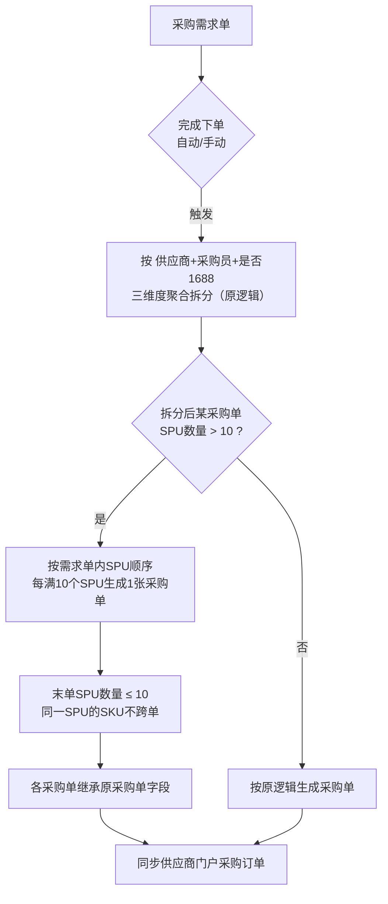
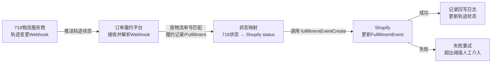

# 0902迭代需求PRD

| 项目名称 | 电商ERP - 0902迭代需求 | 版本号 | V1.0 |
| :--- | :--- | :--- | :--- |
| 文档状态 | 草稿 | 编写人 | 谢涛 |
| 适用角色 | 供应商、采购员、运营 | 最后更新 | 2026-09-04 |

**版本历史**

| 版本 | 日期 | 变更内容 | 修改人 |
| :--- | :--- | :--- | :--- |
| V1.0 | 2026-09-02 | 初稿：功能变更清单、10 需求详设、业务规则、接口规格 | 谢涛 |
| V1.1 | 2026-09-04 | 11 项待确认口径澄清定稿；check-prd 质量修订（乱序兜底、筛选取值口径、列位置、delivered_at 补偿等） | 谢涛 |

---

## 一、变更背景

本次迭代包含10个需求点，分属供应商门户、订单履约平台两个系统：①采购订单打印SKU标签补充供应商SPU货号；②采购需求完成下单时按SPU数量上限拆分采购单；③订单履约平台接收718物流Webhook后主动回写Shopify FulfillmentEvent；④订单履约平台对外提供物流轨迹查询API；⑤Shopify订单列表导出新增「是否改仓」「品类」字段、列表新增供应商多选筛选；⑥采购单管理列表新增招商BD人员、SPU货号、SKU货号显示列及对应筛选；⑦门户采购订单列表新增招商BD人员、易仓PO单号显示列与筛选、内部SKU编码筛选；⑧入库通知页SKU查看数量弹窗及导出新增品类字段；⑨入库通知同步易仓时将SKU对应供应商品牌类型写入 `product_list.note`，与仓发邀约同字段时用 `|` 拼接；⑩Shopify订单列表与拆单管理页面新增「标签」筛选（输入框模糊匹配）。

**各需求变更价值（Why）：**

| 需求 | 要解决什么 |
| :--- | :--- |
| 1 | 标签补充供应商SPU货号，供应商贴标/复核有据可依 |
| 2 | SPU过多超出供应商单张接单容量，按数量上限拆分控制单量 |
| 3 | 买家在 Shopify 端实时看到物流轨迹状态，减少物流咨询与纠纷 |
| 4 | 易仓/内部系统按物流单号或订单号自助查轨迹，替代人工查询 |
| 5 | 导出含改仓与品类便于分析发货/成本结构，支持按供应商组合筛选 |
| 6 | 采购侧按招商BD跟进供应商、按货号快速定位商品 |
| 7 | 门户侧核对 PO 归属与内部编码，减少对单差错 |
| 8 | 入库按品类核对与统计，支撑分区上架与报表 |
| 9 | 同步品牌类型供易仓侧区分货品属性 |
| 10 | 按店铺标签快速定位活动/渠道订单 |

---

## 二、功能变更清单

| 序号 | 功能模块 | 所属平台 | 功能简述 | 优先级 |
| :--- | :--- | :--- | :--- | :--- |
| 1 | 打印SKU标签加供应商货号 | 供应商门户 | 采购订单打印SKU标签（单个+批量），在颜色/尺码下方新增「供应商SPU货号」 | P0 |
| 2 | 采购需求完成下单SPU拆单 | 订单履约平台 | 完成下单时（自动+手动），在现有拆分条件基础上，采购单SPU数量>10则拆分，每单SPU≤10 | P0 |
| 3 | 718Webhook回写Shopify | 订单履约平台 | 接收718物流轨迹变更Webhook，状态映射后主动调用Shopify FulfillmentEvent接口 | P0 |
| 4 | 物流轨迹查询API | 订单履约平台 | 对外提供两个API：按物流单号查轨迹、按shopify订单号查物流单号及轨迹 | P0 |
| 5 | Shopify订单列表导出与供应商筛选 | 订单履约平台 | 导出新增「是否改仓」「品类（内部品类多级-拼接）」字段（按订单×商品维度）；列表新增供应商多选筛选 | P1 |
| 6 | 采购单管理新增招商BD与货号 | 订单履约平台 | 列表新增招商BD人员、SPU货号、SKU货号显示列及对应筛选 | P1 |
| 7 | 门户采购订单新增招商BD与易仓PO | 供应商门户 | 采购订单列表新增招商BD人员、易仓PO单号列及筛选，新增内部SKU编码筛选 | P1 |
| 8 | 入库通知新增品类字段 | 订单履约平台 | SKU查看数量弹窗与导出新增品类字段（内部品类多级-拼接） | P1 |
| 9 | 入库通知同步易仓传递品牌类型 | 订单履约平台 | 同步易仓时将SKU对应供应商品牌类型写入 `product_list.note`，与仓发邀约同字段时用 `|` 拼接 | P1 |
| 10 | 订单标签筛选 | 订单履约平台 | Shopify订单列表、拆单管理页面新增「标签」筛选（输入框、模糊匹配） | P1 |

---

## 三、业务流程

### 3.1 打印SKU标签加供应商货号（需求1）

仅打印模板字段变更，流程无变化。单个打印与批量打印共用同一模板。

### 3.2 采购需求完成下单SPU拆单（需求2）

在现有「按供应商+采购员+是否1688」三维度聚合拆分的基础上，叠加SPU数量上限拆分：



**拆分示例：**

一个需求单内23个SPU，按现有三维度聚合后SPU数量>10，拆分为：

| 拆分后采购单 | 包含SPU | SPU数量 |
| :--- | :--- | :--- |
| 采购单A | SPU1 ~ SPU10 | 10 |
| 采购单B | SPU11 ~ SPU20 | 10 |
| 采购单C | SPU21 ~ SPU23 | 3 |

### 3.3 718Webhook回写Shopify FulfillmentEvent（需求3）



> **说明**：本需求为纯后端链路，与现有 `fulfillmentCreate` 物流回写逻辑复用同一Fulfillment定位能力；不同点在于本次回写的是**物流轨迹状态变更事件**（`FulfillmentEvent`），而非发货事件。

### 3.4 物流轨迹查询API（需求4）

对外提供两个查询接口，调用方为易仓ERP及内部其他系统（见 6.3、6.4）。

---

## 四、功能详细设计

### 4.1 打印SKU标签加供应商货号（供应商门户）

#### 4.1.1 变更说明

沿用供应商门户2期「打印SKU条码」功能（原设计见供应商门户2期-订单交互.md §5.3.5），仅调整打印模板字段。

**当前模板（原）：**

- 条码类型：CODE128（仓库扫码设备通用）
- 条码内容：SKU编码（内部SKU条码）
- 条码下方文字：内部SKU、颜色/尺码（颜色取POP英文名称）

**变更后模板（新）：** 在颜色/尺码下方新增一行「供应商SPU货号」。

```
┌─────────────────────┐
│   ( CODE128 条码 )   │
│     内部SKU          │
│  颜色/尺码           │
│  供应商SPU货号       │  ← 新增
└─────────────────────┘
```

#### 4.1.2 触发范围

| 触发方式 | 是否新增供应商SPU货号 |
| :--- | :--- |
| 单个SKU打印（列表商品明细 → 商品信息区域 → 操作列 → 打印条码） | ✅ |
| 批量SKU打印（列表勾选单条订单 → 顶部「打印SKU条码」） | ✅ |

#### 4.1.3 字段数据来源

| 字段 | 数据来源 | 说明 |
| :--- | :--- | :--- |
| 供应商SPU货号 | 商品运营平台接口 | 通过SKU关联查询（复用0630迭代 R3-1 逻辑），以SKU为查询维度 |

> ⚠️ **注意**：若某SKU未查到供应商SPU货号（商品运营平台无该SPU关联数据），该行**留空显示**，不影响其他字段打印，不阻断打印。

### 4.2 采购需求完成下单SPU拆单（订单履约平台）

#### 4.2.1 变更说明

现有完成下单逻辑（0630迭代版本 功能7）：POD需求点击「完成下单」或自动完成下单后，按**供应商 + 采购员 + 是否1688采购**三个维度聚合拆分生成采购单。

本次变更：在现有三维度聚合拆分**之后**，对SPU数量>10的采购单进行**二次拆分**，每张采购单SPU数量≤10。

#### 4.2.2 拆分规则

| 序号 | 规则描述 |
| :--- | :--- |
| 1 | 「完成下单」包含**手动点击完成下单**与**自动完成下单**，两种方式均触发SPU数量拆分 |
| 2 | 先按原三维度（供应商+采购员+是否1688）聚合拆分；拆分后某采购单SPU数量≤10，维持原逻辑不变 |
| 3 | 拆分后某采购单SPU数量>10，按**需求单内SPU顺序**依次拆分，每满10个SPU生成1张采购单，末单SPU数量≤10 |
| 4 | **同一SPU的所有SKU必须归入同一张采购单**，不允许同一SPU的SKU跨单拆分 |
| 5 | 拆分后各采购单继承原聚合采购单的字段：供应商、采购员、是否1688、采购价、数量、备货主体、税率、期望货期等，保持不变 |
| 6 | 拆分后每张采购单的状态与同步规则沿用原逻辑：供应商开启门户接单 → 状态「待接单」并同步至供应商门户；未开启 → 状态「待采购」，不向门户同步 |

#### 4.2.3 拆分示例

**场景**：一个需求单，按三维度聚合后生成1张采购单，内含23个SPU（SPU1~SPU23）。

**拆分结果**：采购单A（SPU1-10）、采购单B（SPU11-20）、采购单C（SPU21-23）。

**场景**：一个需求单，按三维度聚合后生成2张采购单，其中1张含12个SPU、1张含5个SPU。

**拆分结果**：第1张拆分为2单（10+2），第2张维持1单（5个SPU，不触发拆分）。

### 4.3 718Webhook回写Shopify FulfillmentEvent（订单履约平台）

#### 4.3.1 触发链路

1. **718推送**：718物流服务商在物流轨迹状态变更时，主动推送Webhook至订单履约平台；
2. **平台接收解析**：校验Webhook签名（`verify.sign`）与参数，解析物流单号（`trackNum`）、最新状态码（`trackInfo.result`）及最新轨迹事件（`latest`）；
3. **匹配履约记录**：按 `trackNum` 查询平台 shopify发货单表，获取已存储的 Fulfillment gid；无法匹配则记录日志并丢弃（不阻断其他Webhook）；
4. **状态映射**：将718状态码按映射表映射为Shopify `FulfillmentEventStatus`（见4.3.2映射表），状态码0（NotFound）忽略不推送；
5. **回写Shopify**：调用Shopify `fulfillmentEventCreate` mutation 创建FulfillmentEvent（Shopify事件只可创建、不可编辑，同状态幂等跳过，见4.3.2说明）；
6. **记录日志**：记录回写结果，失败进入重试队列（见七、异常处理）。

#### 4.3.2 状态映射表

以718物流状态码定义表为准，映射至Shopify `FulfillmentEventStatus`：

| 718状态码 | 718状态 (Key) | 718说明 | Shopify status（GraphQL枚举，API传输大写） | 处理说明 |
| :--- | :--- | :--- | :--- | :--- |
| 0 | NotFound | 查询不到：包裹目前查询不到 | — | **忽略**，不调用FulfillmentEvent，仅记录日志 |
| 8 | InTransit | 运输途中：包裹正在转运中 | `IN_TRANSIT` | |
| 10 | NotOnline | 暂未上线：等待上门取件 | `CONFIRMED` | |
| 11 | FirstOnline | 已上网：物流商已取回包裹 | `IN_TRANSIT` | |
| 12 | HasTransit | 已交航：已交给航司/封发/离港 | `IN_TRANSIT` | |
| 13 | ArrivesDestination | 到达目的国 | `IN_TRANSIT` | |
| 20 | Undelivered | 投递失败 | `FAILURE` | 后续重新派送成功可再推40 |
| 30 | PickUp | 到达待取 | `READY_FOR_PICKUP` | |
| 31 | OnDelivery | 派送途中 | `OUT_FOR_DELIVERY` | |
| 40 | Delivered | 签收成功 | `DELIVERED` | |
| 50 | Alert | 可能异常 | `FAILURE` | 后续重新派送成功可再推40 |
| 51 | TransitTooLong | 运输过久（超2个月） | `DELAYED` | |
| 65 | Returned | 包裹退回寄件人 | `FAILURE` | |

> 说明：
> 1. 多个718状态映射至同一Shopify状态（如 8/11/12/13 → `IN_TRANSIT`）时，**仅首次推送创建该状态的FulfillmentEvent**；后续同状态Webhook**幂等跳过**、不重复调用（Shopify事件只可创建、不可编辑，重复创建会造成买家端时间线重复刷屏）；轨迹明细记录在履约平台自身、供需求4查询API使用，仅当映射后的Shopify状态发生变化时才创建新事件；
> 2. `NotFound(0)` 无对应Shopify状态且非物流事件，**忽略不推送**；
> 3. `Undelivered(20)` 投递失败、`Alert(50)` 预警后若后续重新派送成功，均可再推送 `Delivered(40)` → `DELIVERED`；`Returned(65)` 推送 `FAILURE` 后若产生退回终态，以易仓/商家侧处理为准，不重复推送；
> 4. 状态映射关系静态写入代码（固定映射），不提供后台配置入口；新增/调整映射随版本发布（若后续需频繁调整，可评估抽离为配置中心，非本期范围）。

#### 4.3.3 fulfillmentEventCreate 传参映射与调用示例

**调用目标：** Shopify GraphQL `fulfillmentEventCreate` mutation（仅可创建新事件，不可编辑既有事件，同状态幂等跳过）

**参数映射（718 Webhook → Shopify 入参）：**

| Shopify 参数 | 必选 | 取值来源（718 Payload） | 处理规则 |
| :--- | :--- | :--- | :--- |
| `fulfillmentId` | 是 | 平台「shopify发货单表」 | 以 `trackNum`（物流单号）查询发货单表已存储的 Fulfillment gid（`gid://shopify/Fulfillment/{id}`），直接使用 |
| `status` | 是 | `list[].trackInfo.result`（最新状态码） | 按4.3.2映射表转换为 Shopify GraphQL 枚举（大写，如 40→`DELIVERED`） |
| `happenedAt` | 否 | `list[].latest.date` + `list[].latest.addressInfo.timeZone` | 718本地时间按 `timeZone` 换算为 UTC，ISO8601 Z 格式传输（如 `2024-04-18 09:59:51`(UTC-7) → `2024-04-18T16:59:51Z`） |

> 实际调用**仅传上述3个参数**；`FulfillmentEventInput` 其余字段（`message`、`country`、`locationId` 等）一律不传。

**718 Payload 解析口径（Webhook 触发时）：**

| Payload 字段 | 含义 | 用途 |
| :--- | :--- | :--- |
| `list[].trackNum` | 物流单号（示例中为脱敏值 `******`，推送口径沿用既有718对接） | 匹配 shopify发货单表 |
| `list[].code` | 承运商编码（如 fedex） | 辅助校验 |
| `list[].trackInfo.result` | 最新物流状态码 | 主状态源 → 映射 Shopify status |
| `list[].latest` | 最新轨迹事件节点（date/status/addressInfo.timeZone 等） | 取 `date` + `addressInfo.timeZone` 换算 happenedAt（UTC）；`status`、`country` 本期不传 Shopify，无需使用 |
| `list[].fromDetail[]` | 完整历史轨迹事件 | 需求4「按物流单号查询轨迹」明细数据源 |
| `verify.sign` | 数据签名 | Webhook 合法性校验 |

**调用示例（基于718示例数据，result=40 Delivered）：**

```json
{
  "fulfillmentEvent": {
    "fulfillmentId": "gid://shopify/Fulfillment/{查shopify发货单表所得}",
    "status": "DELIVERED",
    "happenedAt": "2024-04-18T16:59:51Z"
  }
}
```

**执行时序约束：**
1. **同状态幂等**：该 Fulfillment 已创建某 status 事件后，718 再次推送映射到同一 status 的状态码（如 11/12/13 → `IN_TRANSIT`），跳过不调用；
2. **状态推进**：仅当映射后的 status 与已推送最新状态不同时调用 `fulfillmentEventCreate`；
3. **匹配失败**：`trackNum` 在 shopify发货单表查不到 → 记录日志跳过，不阻塞其他物流单处理；
4. **调用失败**：进入重试队列（指数退避），连续失败超出阈值推送告警、人工介入；
5. **状态单调推进（防乱序回退）**：已推送 `DELIVERED` 后，后续到达的任何其他状态一律忽略不创建（重复 40 幂等跳过）；已推送 `FAILURE` 后，仅允许 40(Delivered) 继续推进（对应 20 投递失败/50 预警后重新派送成功的既定例外，见 4.3.2 说明③），其余状态忽略不创建。

#### 4.3.4 签收时间回写 delivered_at

**背景：** 718轨迹推送时，若最新状态码为 40（Delivered），除调用 Shopify `fulfillmentEventCreate` 外，还需将签收时间回写至平台本地表，供后续查询/报表/财务结算使用。

**执行时机：** 平台解析出最新状态码 = 40（Delivered）后即执行，与 Shopify 回写相互独立，不受 Shopify 调用结果影响。

**业务规则：**

| 编号 | 规则描述 |
| :--- | :--- |
| 1 | **触发条件**：718 Webhook 最新状态码 `trackInfo.result` = 40（Delivered） |
| 2 | **写入位置**：`sales_shopify_fulfillment.delivered_at` 字段（按 trackNum 定位该发货单记录） |
| 3 | **签收时间来源**：Delivered(40) 对应轨迹事件的时间（即 718 payload `latest.date`，与签收时间一致） |
| 4 | **时区转换**：签收事件本地时间（含其 `addressInfo.timeZone`）→ 换算为 **中国时区（UTC+8）北京时间** 后写入 |
| 5 | **幂等**：同一发货单（trackNum）的 `delivered_at` 已写入时，不重复更新（重复推送 40 幂等跳过） |
| 6 | **写库失败补偿**：`delivered_at` 写入失败记录日志并进入与 Shopify 回写同一重试队列；Shopify 已成功而本地持续失败时提供后台补录/人工修复，财务对账以 `delivered_at` 为准 |

**换算示例：**

加州签收 `2024-04-18 09:59:51`（`timeZone: -07:00`）→ UTC `2024-04-18 16:59:51Z` → **北京时间 `2024-04-19 00:59:51` 写入 `delivered_at`**。

### 4.4 物流轨迹查询API（订单履约平台）

订单履约平台对外提供两个查询接口，供易仓ERP及内部系统调用，详见「六、接口规格与传参」。

| 接口 | 用途 | 调用方 |
| :--- | :--- | :--- |
| 按物流单号查询轨迹 | 根据物流单号返回该单号的全部轨迹事件 | 易仓ERP / 内部系统 |
| 按shopify订单号查询物流单号及轨迹 | 根据shopify订单号返回该订单全部物流单号及每个物流单号的轨迹信息 | 易仓ERP / 内部系统 |

---

### 4.5 Shopify订单列表导出与供应商筛选（订单履约平台）

**功能概述：** 订单履约平台「Shopify订单列表」页面（独立菜单页）导出功能新增「是否改仓」「品类」字段；列表筛选区新增「供应商」多选下拉。

#### 4.5.1 导出新增字段

| 导出字段 | 取值示例 | 取值说明 |
| :--- | :--- | :--- |
| 是否改仓 | 是 / 否 | 导出按**订单×商品**维度展开（每行=一个订单×一个商品，与现有导出粒度一致，不按拆单子订单再展开）；「是否改仓」取该商品行所属拆单子订单的「已改仓」标识（该子订单曾手动修改过仓发地=是，否则=否） |
| 品类 | `服装-上衣-T恤` | 商品对应的内部品类完整多级路径（一级→二级→末级），各级之间用 `-` 拼接；商品无内部品类时显示为空 |

**数据来源：**

| 字段 | 数据来源 | 说明 |
| :--- | :--- | :--- |
| 是否改仓 | 拆单子订单记录 | 商品行归属的拆单子订单「已改仓」标识（手动修改过仓发地的子订单，见自动拆单履约迭代PRD 6.4） |
| 品类 | 商品运营平台品类库 | 商品关联的内部品类，取完整层级路径，用 `-` 拼接 |

> 导出列位置：新增「是否改仓」「品类」两列**追加至现有导出列末尾**，不改变既有列顺序。
> 拆单口径：拆单以**商品行为单位**整体划入子订单，同一商品不跨子订单拆分，故导出商品行可唯一确定其所属子订单与「是否改仓」标识。

#### 4.5.2 列表新增筛选

| 筛选项 | 控件类型 | 说明 |
| :--- | :--- | :--- |
| 供应商 | 下拉多选（**可输入搜索**） | 支持勾选多个供应商组合查询 |

> 筛选逻辑：**不同筛选项之间为「且」，供应商多选内部为「或」**；供应商选项量大时支持输入关键词检索。

### 4.6 采购单管理新增列与筛选（订单履约平台）

**功能概述：** 订单履约平台「采购单管理」列表新增「招商BD人员」「SPU货号」「SKU货号」显示列及对应筛选。

#### 4.6.1 列表新增显示列

| 新增列 | 展示位置 | 取值规则 |
| :--- | :--- | :--- |
| 招商BD人员 | 供应商列之后一列 | 通过采购单商品关联的供应商，查询「供应商列表」中的招商BD人员字段；商品关联多个供应商时，取商品主数据「商品列表」同步的**默认供应商标记**（商品主数据维护并随同步下发，按商品关联查询）；无供应商或无BD显示 `—` |
| SPU货号 | 商品信息列区域 | 外部商品显示其SPU货号；内部商品无SPU货号显示为 `—` |
| SKU货号 | 商品信息列区域 | 外部商品显示其SKU货号；内部商品无SKU货号显示为 `—` |

> 新增列插入顺序：招商BD紧随「供应商」列之后；SPU货号、SKU货号置于商品信息展示区（原无货号列则新增，位于商品信息列之后）；不改变既有列相对顺序。

#### 4.6.2 列表新增筛选

| 筛选项 | 控件类型 | 说明 |
| :--- | :--- | :--- |
| 招商BD人员 | 下拉多选（**可输入搜索**） | 选项数据源：供应商列表中配置的招商BD人员（去重后） |
| SPU货号 | 文本输入 | 精准匹配 |
| SKU货号 | 文本输入 | 精准匹配 |

> 筛选逻辑：**不同筛选项之间为「且」，招商BD多选内部为「或」**。

---

### 4.7 门户采购订单新增列与筛选（供应商门户）

**功能概述：** 供应商门户采购订单列表（供应商门户2期 §5.3.2，与需求1同页面）新增「招商BD人员」「易仓PO单号」显示列与筛选，新增「内部SKU编码」筛选。

#### 4.7.1 列表新增显示列

| 新增列 | 展示位置 | 取值规则 |
| :--- | :--- | :--- |
| 招商BD人员 | 供应商名称列后一列 | 通过订单商品关联的供应商，查询「供应商列表」中的招商BD人员字段；商品关联多个供应商时，取商品主数据「商品列表」同步的**默认供应商标记**（商品主数据维护并随同步下发，按商品关联查询）；无供应商或无BD显示 `—` |
| 易仓PO单号 | 招商BD人员列之后 | 关联入库通知持有的易仓采购单号 `po_code`（入库通知持有 `po_code` 与内部采购单/采购订单的关联关系）；关联多个入库通知时显示全部 `po_code`（`、`分隔）；无关联显示 `—` |

> 列顺序：供应商名称 → 招商BD人员 → 易仓PO单号

#### 4.7.2 列表新增筛选

| 筛选项 | 控件类型 | 说明 |
| :--- | :--- | :--- |
| 招商BD人员 | 下拉多选（**可输入搜索**） | 选项数据源：供应商列表中配置的招商BD人员（去重后） |
| 易仓PO单号 | 文本输入 | 精准匹配 |
| 内部SKU编码 | 文本输入 | 精准匹配 |

> 筛选逻辑：**不同筛选项之间为「且」，招商BD多选内部为「或」**。「内部SKU编码」指采购订单行商品在 ERP 的内部SKU编码（与打印SKU标签的「内部SKU」同源，见4.1.1），按订单行生效。

### 4.8 入库通知新增品类字段（订单履约平台）

**功能概述：** 订单履约平台「入库通知」相关界面（SKU查看数量弹窗、列表导出）新增「品类」字段展示，取商品对应内部品类完整多级路径，用 `-` 拼接。

#### 4.8.1 SKU查看数量弹窗新增品类

| 变更位置 | 变更内容 |
| :--- | :--- |
| SKU查看数量弹窗 | SKU行区域新增「品类」列/字段，取该SKU商品对应的内部品类完整多级路径（一级→二级→末级）用 `-` 拼接，如 `服装-上衣-T恤`；无内部品类显示为空 |

#### 4.8.2 导出新增品类

| 变更位置 | 变更内容 |
| :--- | :--- |
| 入库通知列表导出 | 导出字段新增「品类」列，取值与SKU查看数量弹窗一致（内部品类多级路径 `-` 拼接） |

> 品类拼接规则与需求5（R5-2）一致：一级→二级→末级完整路径用 `-` 拼接。
> 展示位置：导出「品类」列追加至入库通知导出列末尾；弹窗「品类」随 SKU 行展示（置于 SKU 编码/数量字段之后）。

---

### 4.9 入库通知同步易仓传递品牌类型（订单履约平台）

**功能概述：** 入库通知同步易仓时，将 SKU 对应供应商的「品牌类型」写入易仓 `product_list.note`；该字段此前已承载「仓发邀约」标签（见724迭代PRD §3.10），两者同时存在时用 `|` 拼接后一并传递。

**变更说明：** 在724迭代PRD §3.10（入库通知同步易仓参数传递）基础上扩展——note 由"整单统一（仓发邀约）"升级为**按SKU明细逐条计算**，承载「仓发邀约」「品牌类型」两类标签片段。

**触发链路：**

```plaintext
1. 入库通知触发同步易仓
2. 对该入库通知下每条产品明细（SKU）逐条计算 note：
   a. 若该SKU所属采购单带「仓发邀约」标签 → note片段 = 仓发邀约
   b. 若该SKU对应供应商配置了「品牌类型」 → note片段 = 品牌类型值
   c. 片段拼接：两者都有 → "仓发邀约|品牌类型值"；仅其一 → 该片段；都无 → note 为空
3. 同步易仓：设置 Request.product_list.note（每条明细各自取值）
```

**note 取值矩阵：**

| 仓发邀约标签 | 供应商品牌类型 | Request.product_list.note |
| :--- | :--- | :--- |
| 有 | 有 | `仓发邀约\|品牌类型值`（如 `仓发邀约\|白牌`） |
| 有 | 无 | `仓发邀约` |
| 无 | 有 | `品牌类型值`（如 `品牌商`） |
| 无 | 无 | 空（不传递） |

**调用示例：**

```
采购单：PO-A（标签：仓发邀约），供应商品牌类型=白牌
采购单：PO-B（无标签），供应商品牌类型=品牌商
入库通知：IN-20260902-001（关联PO-A、PO-B）
产品明细：
  - SKU-A（属PO-A）note='仓发邀约|白牌'
  - SKU-B（属PO-A）note='仓发邀约|白牌'
  - SKU-C（属PO-B）note='品牌商'
```

---

### 4.10 Shopify订单列表/拆单管理新增标签筛选（订单履约平台）

**功能概述：** 「Shopify订单列表」「拆单管理」两个页面新增「标签」筛选，输入框、支持模糊匹配，用于按 Shopify 订单标签（tags / 标记）快速定位订单。标签数据源为 Shopify 订单 tags，履约平台「标记」字段已同步该数据（现有字段，本次不涉及数据接入改造），仅新增筛选控件。

#### 4.10.1 Shopify订单列表页面

| 筛选项 | 控件类型 | 匹配方式 | 说明 |
| :--- | :--- | :--- | :--- |
| 标签 | 文本输入 | 模糊匹配 | 按该页订单的标签（Shopify tags）模糊过滤 |

#### 4.10.2 拆单管理页面

| 筛选项 | 控件类型 | 匹配方式 | 说明 |
| :--- | :--- | :--- | :--- |
| 标签 | 文本输入 | 模糊匹配 | 作用于一级 Shopify 订单维度的「标记」字段（拆单管理一级订单列的标记，即 Shopify tags） |

> 交互口径：输入后**回车/失焦触发**检索（不做边输边筛），单关键词模糊匹配（%keyword%）；清空输入恢复全量列表；无标签订单不被命中（R10-3）。Shopify订单列表页与拆单管理页行为一致。

---

## 五、业务规则

| 编号 | 所属需求 | 规则描述 |
| :--- | :--- | :--- |
| R1-1 | 需求1 | 打印SKU标签在颜色/尺码下方新增「供应商SPU货号」，单个打印与批量打印均生效 |
| R1-2 | 需求1 | 供应商SPU货号通过SKU关联商品运营平台接口获取；未查到则留空显示，不阻断打印 |
| R1-3 | 需求1 | 打印模板其余字段（CODE128条码、内部SKU、颜色/尺码）保持不变 |
| R2-1 | 需求2 | 采购需求「完成下单」（手动+自动）均在现有三维度聚合拆分基础上叠加SPU数量拆分 |
| R2-2 | 需求2 | 仅当拆分后采购单SPU数量>10时触发二次拆分，每单SPU≤10 |
| R2-3 | 需求2 | 按需求单内SPU顺序每满10个SPU成1单，末单SPU≤10 |
| R2-4 | 需求2 | 同一SPU的所有SKU必须归入同一张采购单，不跨单拆分 |
| R2-5 | 需求2 | 拆分后各采购单继承原采购单字段（供应商、采购员、是否1688、采购价、数量、备货主体、税率等） |
| R2-6 | 需求2 | 拆分后采购单状态与门户同步规则沿用原逻辑（待接单/待采购） |
| R3-1 | 需求3 | 718Webhook推送轨迹状态后，按718状态码对照映射表映射为Shopify FulfillmentEventStatus |
| R3-2 | 需求3 | 多对一映射时（如状态码8/11/12/13→IN_TRANSIT），仅首次推送创建该状态事件，后续同状态幂等跳过（Shopify事件只可创建、不可编辑）；轨迹明细存履约平台供查询API使用，仅状态变化时创建新事件 |
| R3-3 | 需求3 | 按 trackNum 在 shopify发货单表无法匹配 Fulfillment 时，记录日志并跳过，不阻塞其他Webhook处理 |
| R3-4 | 需求3 | 718→Shopify 状态映射关系静态写入代码（固定映射），不提供后台配置入口 |
| R3-5 | 需求3 | 718状态码0（NotFound）无对应Shopify状态，忽略不推送，仅记录日志 |
| R3-6 | 需求3 | fulfillmentId 从平台 shopify发货单表按 trackNum 查询已存储的 Fulfillment gid，直接使用 |
| R3-7 | 需求3 | Shopify 实际调用仅传 `fulfillmentId`/`status`/`happenedAt` 三参数；`message`/`country` 不传；`happenedAt` 按 `latest.addressInfo.timeZone` 换算为 UTC ISO8601 Z 格式 |
| R3-8 | 需求3 | 718推送最新状态码=40(Delivered)时，将 Delivered 事件签收时间转为北京时间(UTC+8)写入 `sales_shopify_fulfillment.delivered_at`；同一发货单已写入则不重复更新（重复推送40幂等跳过） |
| R3-9 | 需求3 | 状态单调推进：已推送 DELIVERED 后忽略后续其他状态；已推送 FAILURE 后仅允许 40(Delivered) 推进（对应 20 投递失败/50 预警后重送成功的例外）；防止 718 乱序推送造成 Shopify 时间线回退（事件不可编辑） |
| R4-1 | 需求4 | 物流轨迹查询API需记录操作日志（谁、何时、查询范围） |
| R4-2 | 需求4 | 查询API不涉及导出，不受导出行数上限（10000行）约束；若后续扩展导出能力需按默认规则执行 |
| R5-1 | 需求5 | 导出按订单×商品维度展开（每行=一个订单×一个商品，不因拆单再细分行）；「是否改仓」取该商品行所属拆单子订单的「已改仓」标识（是/否） |
| R5-2 | 需求5 | 「品类」取商品对应内部品类完整多级路径，各级用 `-` 拼接；无内部品类显示为空 |
| R5-3 | 需求5 | Shopify订单列表新增「供应商」多选下拉筛选，多选供应商之间为「或」关系 |
| R5-4 | 需求5 | 导出需权限校验并记录操作日志；单次导出默认上限10000行，如有例外需在PRD单独说明 |
| R6-1 | 需求6 | 「招商BD人员」列通过采购单商品关联供应商查询「供应商列表」招商BD人员字段；商品关联多个供应商时取商品主数据同步的**默认供应商标记**；无供应商或无BD显示 `—` |
| R6-2 | 需求6 | 「SPU货号」「SKU货号」列仅外部商品显示对应货号；内部商品显示 `—` |
| R6-3 | 需求6 | 「招商BD人员」筛选为下拉多选，选项取供应商列表招商BD人员去重 |
| R6-4 | 需求6 | 「SPU货号」「SKU货号」筛选为文本输入精准匹配 |
| R7-1 | 需求7 | 「招商BD人员」列通过订单商品关联供应商查询「供应商列表」招商BD人员字段；商品关联多个供应商时取商品主数据同步的**默认供应商标记**；无供应商或无BD显示 `—` |
| R7-2 | 需求7 | 「易仓PO单号」列取订单关联入库通知的易仓采购单号 `po_code`；关联多个入库通知时显示全部 `po_code`（`、`分隔）；无关联显示 `—` |
| R7-3 | 需求7 | 列顺序：供应商名称 → 招商BD人员 → 易仓PO单号 |
| R7-4 | 需求7 | 「招商BD人员」筛选为下拉多选，选项取供应商列表招商BD人员去重 |
| R7-5 | 需求7 | 「易仓PO单号」「内部SKU编码」筛选为文本输入精准匹配 |
| R8-1 | 需求8 | 「品类」取商品对应内部品类完整多级路径用 `-` 拼接（规则同R5-2），无内部品类显示为空 |
| R8-2 | 需求8 | SKU查看数量弹窗与导出的品类取值口径一致 |
| R9-1 | 需求9 | 入库通知同步易仓时，对每条产品明细（SKU）逐条计算 `product_list.note` |
| R9-2 | 需求9 | 品牌类型取该SKU对应供应商（供应商列表）配置的「品牌类型」字段值 |
| R9-3 | 需求9 | note 片段拼接：仓发邀约在前、品牌类型在后，用 `|` 分隔；仅其一则传单值，都无则note为空不传递 |
| R9-4 | 需求9 | 仓发邀约标签判定沿用724迭代PRD §3.10：该SKU所属采购单带「仓发邀约」标签 |
| R9-5 | 需求9 | 同步易仓参数 `Request.product_list.note` 为逐明细字符串，无额外转义 |
| R9-6 | 需求9 | 「品牌类型」取供应商列表/供应商管理已维护的品牌类型字段值（供应商维度已有字段，直接查询，无需新增枚举清单） |
| R10-1 | 需求10 | Shopify订单列表、拆单管理两页新增「标签」筛选，输入框模糊匹配（%keyword%） |
| R10-2 | 需求10 | 标签筛选数据源为 Shopify 订单 tags（标记）；拆单管理页作用于一级订单维度 |
| R10-3 | 需求10 | 标签为空/无标签的订单，输入关键词时不被命中 |

---

## 六、接口规格与传参

### 6.1 概览

| 接口 | 方向 | 说明 |
| :--- | :--- | :--- |
| 718Webhook接收 | 718 → 订单履约平台 | 物流轨迹变更推送（需求3触发源） |
| fulfillmentEventCreate | 订单履约平台 → Shopify | 回写FulfillmentEvent（需求3，传参映射见4.3.3） |
| getTrackingByLogisticsNo | 外部 → 订单履约平台 | 按物流单号查询轨迹（需求4-a） |
| getLogisticsByShopifyOrderNo | 外部 → 订单履约平台 | 按shopify订单号查询物流单号及轨迹（需求4-b） |

### 6.2 718Webhook接收

**用途：** 接收718物流服务商轨迹变更推送，作为需求3的触发源（payload 解析口径见4.3.3）

**请求方法：** POST（需校验 `verify.sign` 签名）

| 参数名 | 必选 | 类型 | 说明 |
| :--- | :--- | :--- | :--- |
| list[].trackNum | 是 | String | 物流单号（示例中为脱敏值 `******`，推送口径沿用既有718对接） |
| list[].code | 是 | String | 承运商编码（如 fedex） |
| list[].trackInfo.result | 是 | Int | 最新物流状态码（0~65，映射见4.3.2） |
| list[].trackInfo.estimatedDelivery | 否 | String | 预计送达时间区间（如 `2024-04-17 ~ 2024-04-19`） |
| list[].latest.date | 是 | Datetime | 最新轨迹事件时间（718本地时间，含时区） |
| list[].latest.status | 是 | String | 最新轨迹事件英文描述（本期 Shopify 不传 message，暂不使用） |
| list[].latest.addressInfo.country | 是 | String | 事件国家码（如 US；本期 Shopify 不传 country，暂不使用） |
| list[].latest.addressInfo.timeZone | 是 | String | 事件时区偏移（如 -07:00），用于 happenedAt 换算UTC |
| list[].fromDetail[] | 否 | Array | 历史轨迹事件列表（供需求4查询API透传） |
| status.code | 是 | Int | 接口状态码（200=成功） |
| verify.sign | 是 | String | 数据签名 |

> ⚠️ **注**：字段结构按718示例数据整理（如与实际推送有出入，以既有718对接解析口径为准）；`verify.sign` 签名校验沿用既有实现，本次仅做逻辑改造、不涉及签名规则变更。

### 6.3 按物流单号查询轨迹 - getTrackingByLogisticsNo（需求4-a）

**用途：** 外部系统根据物流单号查询该单号全部轨迹信息

**请求方法：** POST

**请求参数：**

| 参数名 | 必选 | 类型 | 说明 |
| :--- | :--- | :--- | :--- |
| tracking_no | 是 | String | 物流单号 |

**返回参数：**

| 参数名 | 类型 | 说明 |
| :--- | :--- | :--- |
| tracking_no | String | 物流单号 |
| carrier_name | String | 承运商名称 |
| logistics_status | String | 最新轨迹状态（映射后Shopify状态，如 IN_TRANSIT） |
| tracking_events | Array | 轨迹事件列表 |
| └ event_time | Datetime | 事件时间 |
| └ event_location | String | 事件地点 |
| └ event_desc | String | 事件描述 |
| └ logistics_status | String | 事件对应状态 |

**请求示例：**

```json
{
    "tracking_no": "LP718202609020001"
}
```

### 6.4 按shopify订单号查询物流单号及轨迹 - getLogisticsByShopifyOrderNo（需求4-b）

**用途：** 外部系统根据shopify订单号查询该订单全部物流单号及每个物流单号的轨迹信息

**请求方法：** POST

**请求参数：**

| 参数名 | 必选 | 类型 | 说明 |
| :--- | :--- | :--- | :--- |
| shopify_order_no | 是 | String | Shopify订单号 |

**返回参数：**

| 参数名 | 类型 | 说明 |
| :--- | :--- | :--- |
| shopify_order_no | String | Shopify订单号 |
| logistics_list | Array | 物流单号列表（该订单下所有履约记录的物流单号） |
| └ tracking_no | String | 物流单号 |
| └ carrier_name | String | 承运商名称 |
| └ logistics_status | String | 最新轨迹状态 |
| └ tracking_events | Array | 该物流单号的轨迹事件列表 |
| └ └ event_time | Datetime | 事件时间 |
| └ └ event_location | String | 事件地点 |
| └ └ event_desc | String | 事件描述 |
| └ └ logistics_status | String | 事件对应状态 |

**请求示例：**

```json
{
    "shopify_order_no": "SO-2026-0902-0001"
}
```

---

## 七、异常处理

| 异常类型 | 所属需求 | 异常场景 | 处理方案 |
| :--- | :--- | :--- | :--- |
| 供应商SPU货号缺失 | 需求1 | SKU未查到供应商SPU货号 | 标签该行留空显示，不阻断打印 |
| 打印字体溢出 | 需求1 | 供应商SPU货号过长导致标签文字溢出 | 自动缩小字号至不溢出，不做截断 |
| 拆单失败 | 需求2 | 二次拆分过程异常（数据库事务失败等） | 回滚本次完成下单全部操作，提示错误，需求单保持原状态可重试 |
| Webhook解析失败 | 需求3 | 718推送数据格式错误/签名校验失败 | 记录失败日志，不进入回写链路 |
| Fulfillment匹配失败 | 需求3 | 按物流单号未匹配到Shopify Fulfillment | 记录日志并跳过，不阻塞其他Webhook处理 |
| Shopify回写失败 | 需求3 | 调用 fulfillmentEventCreate 失败 | 进入重试队列（指数退避），连续失败超出阈值推送告警，人工介入 |
| delivered_at写库失败 | 需求3 | 40 已推送但 `delivered_at` 本地写入异常 | 记录日志并随 Shopify 回写同一重试队列补偿；持续失败提供后台补录，避免结算缺签收时间 |
| 查询无数据 | 需求4 | 物流单号/shopify订单号无轨迹数据 | 返回空轨迹列表（`tracking_events` 为空），code=200正常返回 |

---

## 八、待确认事项

> 本次迭代无待确认事项，全部口径已定稿。

> ✅ **已定稿**：
> - 718状态码→Shopify 映射（13个状态码含3个边界码处理）；`fulfillmentEventCreate` **仅传 `fulfillmentId`/`status`/`happenedAt` 三参数，`message`/`country` 不传**，见 4.3.2、4.3.3；
> - 状态映射关系**静态写入代码**，不做后台配置（R3-4）；
> - Shopify订单列表导出按**订单×商品**维度，「是否改仓」取该商品行所属拆单子订单的标识（R5-1、4.5.1）；
> - 商品关联多个供应商时招商BD取**默认供应商**（R6-1、R7-1）；默认供应商标记维护于商品主数据「商品列表」，随商品主数据同步下发，查询时按商品关联查询；
> - 易仓PO单号关联多个入库通知时**显示全部** `po_code`（R7-2、4.7.1）；
> - 「品牌类型」取供应商列表已维护字段值，无需新增枚举清单（R9-6）；
> - 718 Webhook 签名校验沿用既有对接实现；入库通知导出、标签数据源（Shopify 订单 tags）均为既有能力，本次仅新增字段/筛选项，不涉及新增数据接入。

---

## 九、涉及系统

| 系统名称 | 影响描述 |
| :--- | :--- |
| 供应商门户 | 采购订单打印SKU标签模板新增「供应商SPU货号」字段（单个+批量） |
| 订单履约平台 | 采购需求完成下单SPU数量拆分；接收718Webhook并回写Shopify FulfillmentEvent；对外提供物流轨迹查询API |
| 商品运营平台 | 提供供应商SPU货号数据（以SKU为查询维度，供打印标签调用） |
| 易仓ERP | 接收入库通知同步（`product_list.note` 含仓发邀约/品牌类型）；可作为需求4查询接口的调用方 |
| Shopify | 接收FulfillmentEvent状态回写 |
