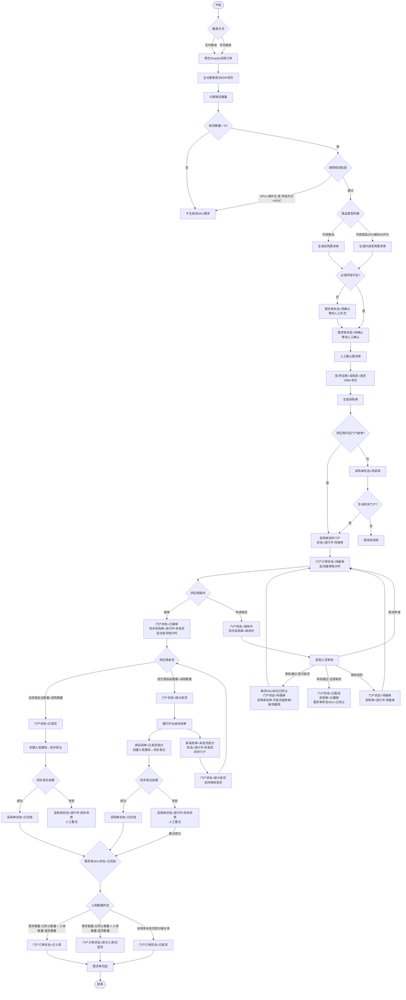
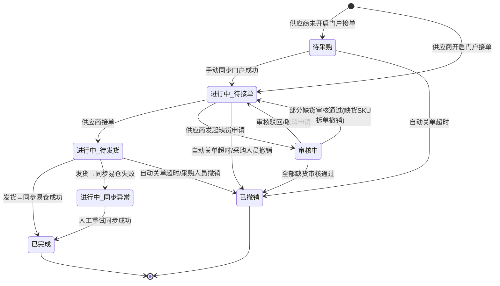
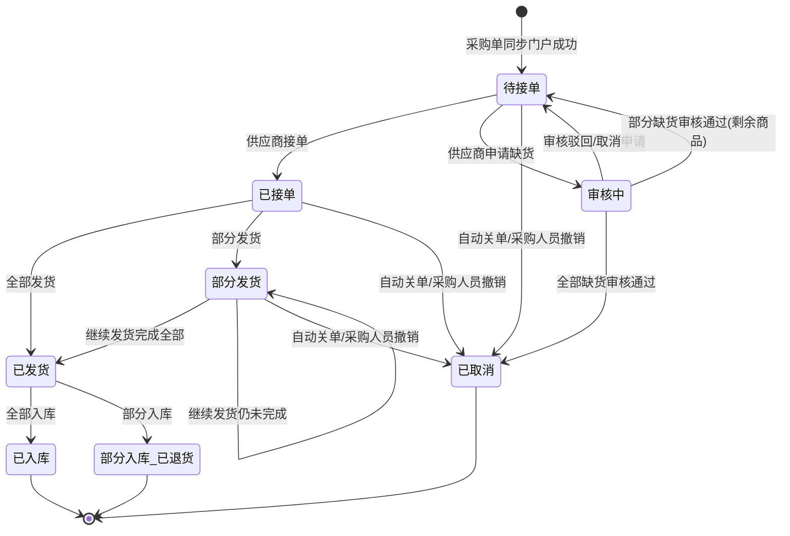
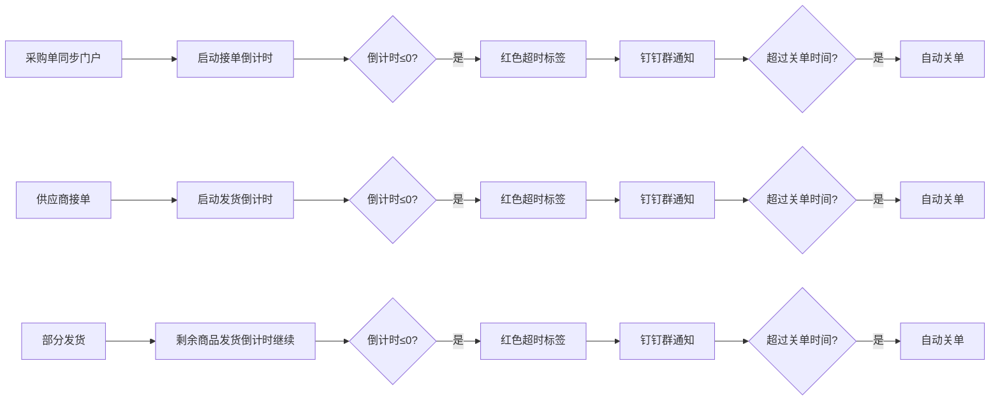
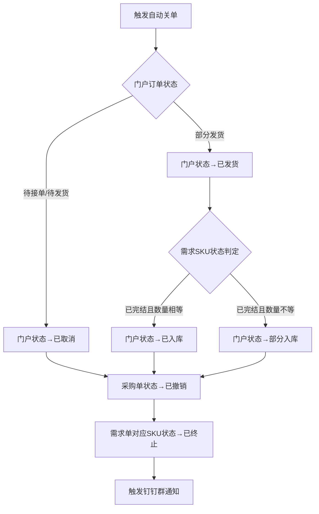

# 供应商门户2期 - 订单交互全流程图

## 一、需求单生成 → 需求单完结 全流程

```mermaid
flowchart TD
    Start([开始]) --> A{触发方式}
    A -->|定时触发| B[聚合Shopify动销订单]
    A -->|手动触发| B

    B --> C[主动更新易仓ERP库存]
    C --> D[计算缺货数量]
    D --> E{缺货数量 > 0?}
    E -->|否| F[不生成该SKU需求]
    E -->|是| G{排除规则检查}
    G -->|SPU=海外仓 或 供给方式=AIGC| F
    G -->|通过| H{商品类型判断}
    H -->|内部商品| I[生成采购需求单]
    H -->|外部商品SPU编码30开头| J[生成外部采购需求单]

    I --> K{必填字段齐全?}
    J --> K
    K -->|否| L[需求单状态=待确认<br/>等待人工补充]
    K -->|是| M[需求单状态=待确认<br/>等待人工确认]

    L --> M

    %% 需求确认转采购单
    M --> N[人工确认需求单]
    N --> O[按 供应商+采购员+是否1688 拆分]
    O --> P[生成采购单]

    %% 采购单状态流转
    P --> Q{供应商开启门户接单?}
    Q -->|是| R[采购单同步门户<br/>状态=进行中-待接单]
    Q -->|否| S[采购单状态=待采购]

    %% 待采购状态
    S --> T{手动同步门户?}
    T -->|是| R
    T -->|否| U[保持待采购]

    %% 门户订单状态流转
    R --> V[门户订单状态=待接单<br/>启动接单倒计时]

    V --> W{供应商操作}
    W -->|接单| X[门户状态=已接单<br/>同步采购单=进行中-待发货<br/>启动发货倒计时]
    W -->|申请缺货| Y[门户状态=审核中<br/>同步采购单=审核中]

    %% 审核流程
    Y --> Z[采购人员审核]
    Z -->|审核通过-部分缺货| Z1[缺货SKU标记已终止<br/>门户状态=待接单<br/>采购单拆单:可发货留原单/缺货撤销]
    Z -->|审核通过-全部缺货| Z2[门户状态=已取消<br/>采购单=已撤销<br/>需求单所有SKU=已终止]
    Z -->|审核驳回| Z3[门户状态=待接单<br/>采购单=进行中-待接单]
    Z -->|取消申请| V

    Z1 --> V
    Z3 --> V

    %% 发货流程
    X --> AA{供应商发货}
    AA -->|全部商品且数量=采购数量| AB[门户状态=已发货]
    AA -->|部分商品或数量<采购数量| AC[门户状态=部分发货]

    %% 部分发货 - 自动拆单
    AC --> AD[履约平台自动拆单]
    AD --> AE[原采购单=已发货部分<br/>创建入库通知→同步易仓]
    AD --> AF[新采购单=未发货部分<br/>状态=进行中-待发货<br/>同步门户]

    AE --> AG{同步易仓结果}
    AG -->|成功| AH[采购单状态=已完成]
    AG -->|失败| AI[采购单状态=进行中-同步异常<br/>人工重试]

    AF --> AJ[门户状态=部分发货<br/>支持继续发货]
    AJ --> AA

    %% 全部发货
    AB --> AK[创建入库通知→同步易仓]
    AK --> AL{同步易仓结果}
    AL -->|成功| AM[采购单状态=已完成]
    AL -->|失败| AN[采购单状态=进行中-同步异常<br/>人工重试]

    %% 入库完结
    AH --> AO{需求单SKU状态=已完结}
    AM --> AO
    AI -->|重试成功| AO

    AO --> AP{入库数量判定}
    AP -->|需求数量-已终止数量 = 入库数量-退货数量| AQ[门户订单状态=已入库]
    AP -->|需求数量-已终止数量 ≠ 入库数量-退货数量| AR[门户订单状态=部分入库/已退货]
    AP -->|采购单未发货部分被关单| AS[门户订单状态=已取消]

    AQ --> AT[需求单完结]
    AR --> AT
    AS --> AT

    AT --> End([结束])
```

---

## 二、采购单状态流转图

```mermaid
stateDiagram-v2
    [*] --> 待采购: 供应商未开启门户接单
    [*] --> 进行中_待接单: 供应商开启门户接单

    待采购 --> 进行中_待接单: 手动同步门户成功
    待采购 --> 已撤销: 自动关单超时

    进行中_待接单 --> 进行中_待发货: 供应商接单
    进行中_待接单 --> 审核中: 供应商发起缺货申请
    进行中_待接单 --> 已撤销: 自动关单超时/采购人员撤销

    审核中 --> 进行中_待接单: 审核驳回/取消申请
    审核中 --> 已撤销: 全部缺货审核通过
    审核中 --> 进行中_待接单: 部分缺货审核通过(缺货SKU拆单撤销)

    进行中_待发货 --> 已完成: 发货→同步易仓成功
    进行中_待发货 --> 进行中_同步异常: 发货→同步易仓失败
    进行中_待发货 --> 已撤销: 自动关单超时/采购人员撤销

    已完成 --> [*]
    已撤销 --> [*]
    进行中_同步异常 --> 已完成: 人工重试同步成功
```

---

## 三、供应商门户订单状态流转图

```mermaid
stateDiagram-v2
    [*] --> 待接单: 采购单同步门户成功

    待接单 --> 已接单: 供应商接单
    待接单 --> 审核中: 供应商申请缺货
    待接单 --> 已取消: 自动关单/采购人员撤销

    审核中 --> 待接单: 审核驳回/取消申请
    审核中 --> 待接单: 部分缺货审核通过(剩余商品)
    审核中 --> 已取消: 全部缺货审核通过

    已接单 --> 已发货: 全部发货
    已接单 --> 部分发货: 部分发货
    已接单 --> 已取消: 自动关单/采购人员撤销

    部分发货 --> 已发货: 继续发货完成全部
    部分发货 --> 部分发货: 继续发货仍未完成
    部分发货 --> 已取消: 自动关单/采购人员撤销

    已发货 --> 已入库: 全部入库
    已发货 --> 部分入库_已退货: 部分入库

    已入库 --> [*]
    部分入库_已退货 --> [*]
    已取消 --> [*]
```

---

## 四、超时与预警机制

```mermaid
flowchart LR
    A[采购单同步门户] --> B[启动接单倒计时]
    B --> C{倒计时≤0?}
    C -->|是| D[红色超时标签]
    D --> E[钉钉群通知]
    E --> F{超过关单时间?}
    F -->|是| G[自动关单]

    H[供应商接单] --> I[启动发货倒计时]
    I --> J{倒计时≤0?}
    J -->|是| K[红色超时标签]
    K --> L[钉钉群通知]
    L --> M{超过关单时间?}
    M -->|是| N[自动关单]

    O[部分发货] --> P[剩余商品发货倒计时继续]
    P --> Q{倒计时≤0?}
    Q -->|是| R[红色超时标签]
    R --> S[钉钉群通知]
    S --> T{超过关单时间?}
    T -->|是| U[自动关单]
```

---

## 五、自动关单状态同步链路

```mermaid
flowchart TD
    A[触发自动关单] --> B{门户订单状态}
    B -->|待接单/待发货| C[门户状态→已取消]
    B -->|部分发货| D[门户状态→已发货]

    D --> E{需求SKU状态判定}
    E -->|已完结且数量相等| F[门户状态→已入库]
    E -->|已完结且数量不等| G[门户状态→部分入库]

    C --> H[采购单状态→已撤销]
    F --> H
    G --> H

    H --> I[需求单对应SKU状态→已终止]
    I --> J[触发钉钉群通知]
```
