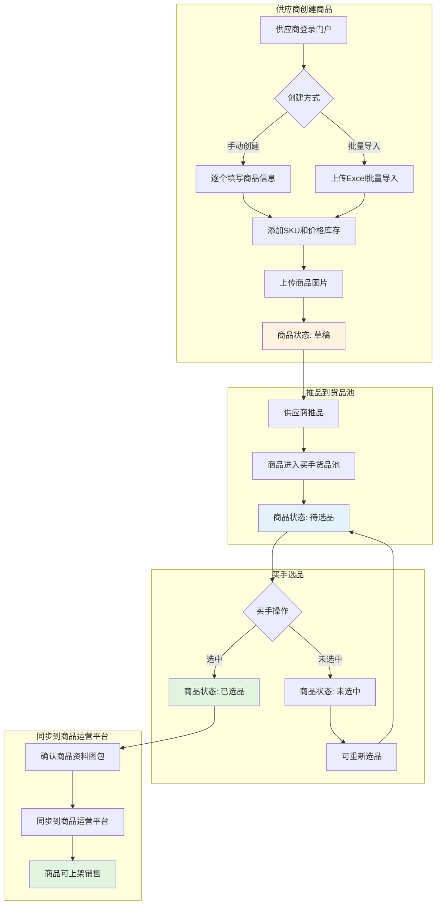
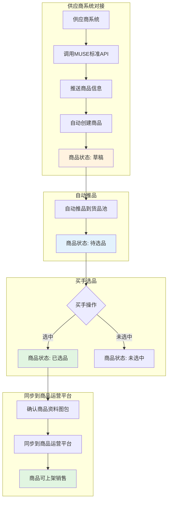
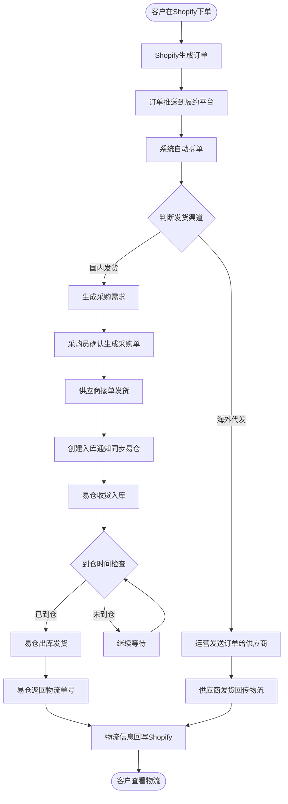
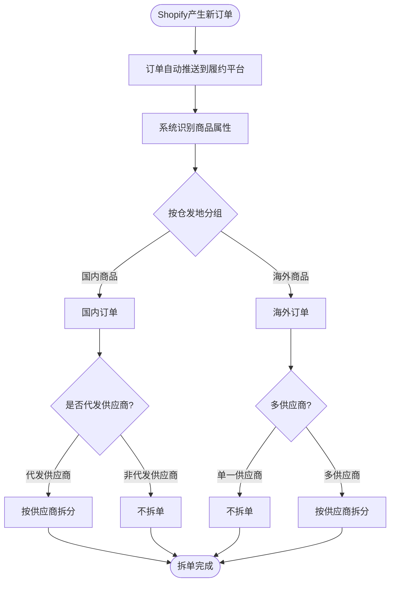
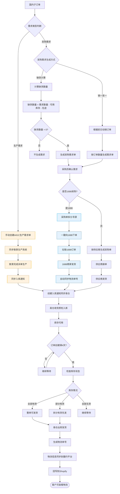
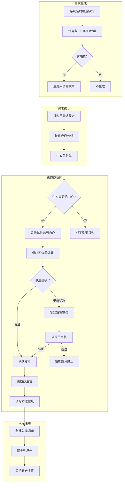
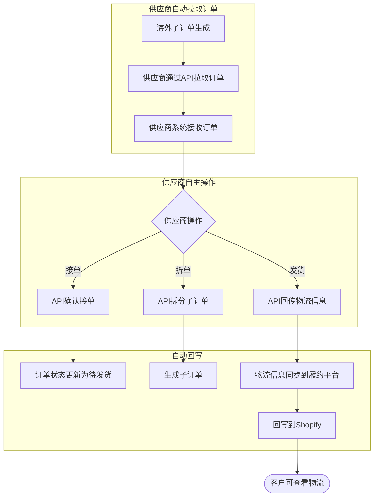
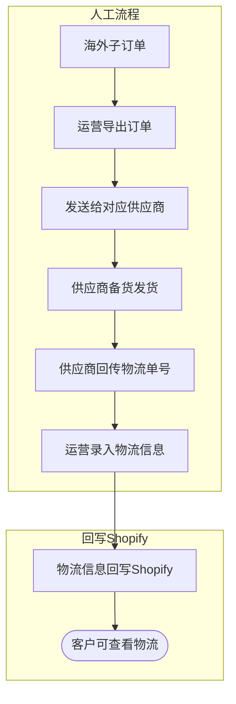
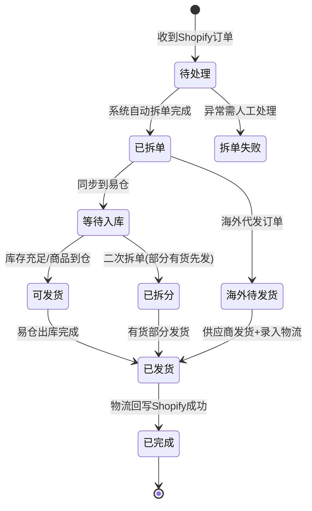

# 订单履约平台 - 全业务流程图

## 系统角色定位

| 系统 | 角色 | 核心职责 |
|------|------|---------|
| Shopify | 订单源 | 客户下单、展示物流信息 |
| 订单履约平台 | 主体 | 接收订单、拆单、需求计划、采购、同步各方 |
| 易仓ERP | 发货执行方 | 入库、出库、发货、返回物流单号 |
| 供应商门户 | 采购协同+商品管理 | 供应商推品、接单、发货、回传信息 |

---

## 推品流程（商品进入销售前）

### 方式一：供应商门户手动创建/批量导入

### 方式二：MUSE标准对接API

**推品流程说明：**

| 方式 | 说明 | 适用场景 |
|------|------|---------|
| 门户手动创建 | 供应商在门户逐个填写商品信息 | 少量商品、新供应商 |
| 门户批量导入 | 供应商通过Excel批量上传商品 | 大量商品、定期更新 |
| MUSE标准API | 供应商系统直接对接API推送商品 | 已有系统的供应商、自动化对接 |

**商品状态流转：**

| 阶段 | 操作 | 商品状态 |
|------|------|---------|
| 创建商品 | 供应商新建商品（手动/API） | 草稿 |
| 推品 | 供应商将商品推入买手货品池 | 待选品 |
| 选品 | 买手筛选商品，选中或淘汰 | 已选品/未选中 |
| 同步 | 确认资料图包后同步到商品运营平台 | 可上架销售 |

---

## 全业务流程总览

---

## 一、订单接收与拆单流程

**拆单规则说明：**

| 优先级 | 仓发地 | 供应商类型 | 拆单规则 |
|-------|--------|-----------|---------|
| 1 | 国内 | 代发供应商（标签包含「代发供应商」） | 按供应商拆单 |
| 1 | 国内 | 非代发供应商 | 不拆单 |
| 1 | 海外 | 所有供应商 | 按供应商拆单 |

---

## 二、国内订单履约流程

**采购需求自动生成方式：**

| 生成方式 | 说明 | 计算公式 |
|---------|------|---------|
| 缺货计算 | 通过计算商品缺货数量生成需求单 | 缺货数量 = 需求数量 - 可用库存 - 在途 |
| 销一采一 | 根据前一天Shopify动销订单直接生成 | 按订单数量生成对应数量需求 |

**说明：**
- 缺货数量 ≤ 0 时不生成该SKU需求单
- 可用库存 = 易仓ERP可用库存（生成前主动更新）
- 在途 = 履约平台中状态为待确认/待下单/待接单/已接单/进行中的需求单数量

**流程说明：**

| 流程分支 | 说明 | 当前状态 |
|---------|------|---------|
| 生产需求（AIGC） | 手动创建AIGC生产需求单 → 同步致景生产系统 → 致景完成派单生产 → 入库通知 → 易仓收货 | ⚠️ **流程已弃用** |
| 采购需求-1688采购 | 采购单拆分寻源 → 一键向1688下单 → 拉取1688订单 → 1688商家发货自动同步物流 → 入库通知 → 易仓收货 | ⚠️ **流程需调整优化才能支持现在1688商品模式** |
| 采购需求-普通采购 | 按供应商生成采购单 → 供应商接单发货 → 入库通知 → 易仓收货 | 正常使用 |

---

## 三、采购需求与供应商门户流程

---

## 四、海外代发流程

### 方式一：供应商API自动化对接（推荐）

### 方式二：人工流程（备用）

### 供应商API能力清单

| 能力 | API接口 | 说明 |
|------|---------|------|
| 拉取订单列表 | 查询订单 | 供应商自主拉取待处理订单 |
| 查看订单详情 | 订单详情 | 获取订单完整信息 |
| 确认接单 | 确认接单 | 供应商确认接单，状态变为待发货 |
| 回传物流 | 订单发货 | 供应商上传物流单号和物流公司 |
| 订单拆单 | 订单拆单 | 代发订单支持供应商拆分（如需分批发货） |
| 缺货申请 | 缺货申请 | 采购订单专用，供应商发起缺货 |

---

## 五、订单状态流转

---

## 六、关键业务节点说明

| 业务节点 | 触发方式 | 负责方 | 说明 |
|---------|---------|-------|------|
| 订单接收 | 实时推送 | 系统自动 | Shopify订单自动推送到履约平台 |
| 首次拆单 | 定时触发(每5分钟) | 系统自动 | 按仓发地+供应商规则拆分 |
| 同步易仓 | 拆单后自动触发 | 系统自动 | 国内订单同步到易仓等待发货 |
| 缺货计算 | 定时触发(每天2次) | 系统自动 | 计算缺口生成采购需求 |
| 需求确认 | 人工操作 | 采购员 | 确认需求单生成采购单 |
| 供应商接单 | 人工操作 | 供应商 | 通过门户接单或线下确认 |
| 供应商发货 | 人工操作 | 供应商 | 发货并回传物流信息 |
| 入库收货 | 到货触发 | 仓库 | 收货→质检→上架 |
| 二次拆单 | 定时触发(订单满4天) | 系统自动 | 检查库存，部分有货先发 |
| 出库发货 | 入库完成后触发 | 仓库 | 拣货→打包→发货 |
| 物流回写 | 定时触发(每10分钟) | 系统自动 | 获取物流单号回写Shopify |

---

## 七、异常处理

| 异常场景 | 处理方式 |
|---------|---------|
| 拆单失败 | 自动重试3次，失败后人工介入 |
| 易仓同步失败 | 自动重试，失败后人工处理 |
| 供应商门户超时 | 自动关单，通知相关人员 |
| 库存不足 | 等待采购到货或二次拆单 |
| 物流回写失败 | 自动重试，失败后人工补录 |
