# 订单拆分方案 - 业务流程分析

## 业务背景

### 现状

- 公司做跨境电商业务，在 Shopify 开店，所有动销订单来源于 Shopify
- 商品来源多元化：
  - 供应商商品（国内发货 + 海外一件代发）
  - 其他平台海外一件代发（CJ、Trendsi、阿里国际）
- 国内发货商品先采购回自有仓库，使用第三方 SaaS 系统**易仓**承接入库和出库流程
- 订单履约平台负责与易仓 ERP 数据打通

### 痛点

- 需要根据商品仓发地和供应商进行拆单（先按国内/海外拆，海外再按供应商拆）
- 国内发货商品需根据到仓时间拆单：订单创建 X 天后检查实际入库状态，已入仓的先发货，避免整单等待
- 易仓不支持以上拆分规则
- 海外代发目前全靠人工线下表格流转，效率低

### 核心约束

| 约束项 | 说明 |
|-------|------|
| 易仓拉单方式 | 易仓从 Shopify 独立拉取订单 |
| 物流回传 | 方案一二：易仓自行回传 Shopify；方案三：履约平台拉取后回传 |
| 国内库存 | 库存在易仓，必须在易仓完成出库 |
| 海外供应商 | 10+ 家，目前无系统对接，靠人工表格 |
| 二次拆单 | 需易仓支持取消原单 + 创建新订单（方案一三适用，方案二不支持） |

---

## 拆单规则

### 首次拆单（订单进入时）

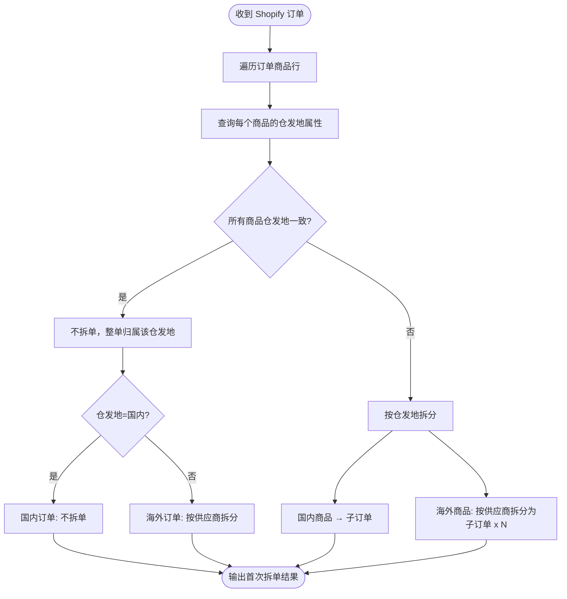

**首次拆单规则：**

| 优先级 | 拆单维度 | 判断字段 | 拆单逻辑 |
|-------|---------|---------|---------|
| 1 | 仓发地 | 商品的仓发地属性 | 国内 vs 海外，拆成两组 |
| 2 | 供应商 | 商品关联的供应商 | 海外部分按供应商再拆 |

### 二次拆单（定时任务 - 到仓时间检查）

首次拆单后的国内订单进入待发货队列，由**定时任务**定期检查：

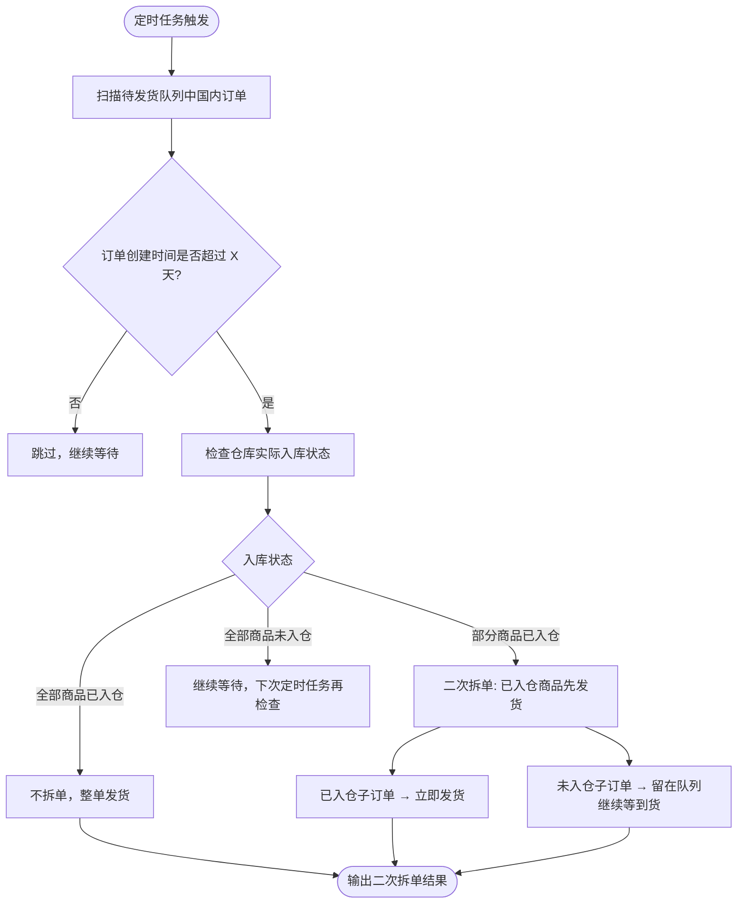

**二次拆单规则说明：**
- 定时任务定期扫描待发货队列中的国内订单
- 判断条件：**当前时间 - 订单创建时间 ≥ X 天**
- 满足条件后检查仓库实际入库状态：

| 入库状态 | 处理方式 |
|---------|---------|
| 全部商品已入仓 | 不拆单，整单直接发货 |
| 部分商品已入仓 | 二次拆单：已入仓商品组成子订单立即发货，未入仓商品留在队列继续等 |
| 全部商品未入仓 | 不拆单，留在队列，下次定时任务再检查 |

---

## 方案一：易仓拉单 → Agent 拉易仓订单 → 履约平台拆单 → 调用易仓拆单接口

### 方案概述

- 易仓从 Shopify 拉取原始订单（现有流程不变）
- Agent 从易仓拉取订单数据，订单履约平台按规则拆单
- 拆单结果调用易仓拆单接口完成易仓侧拆单
- **全程不与 Shopify 交互**，Shopify 侧的物流回传由易仓自行处理

### 主流程

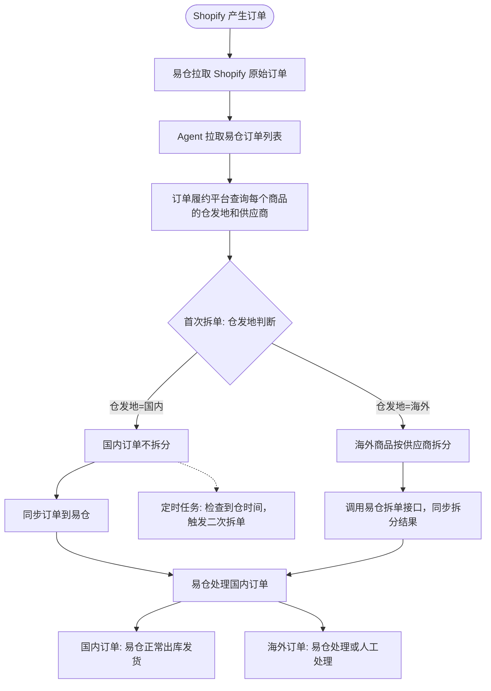

### Agent 执行流程（详细）

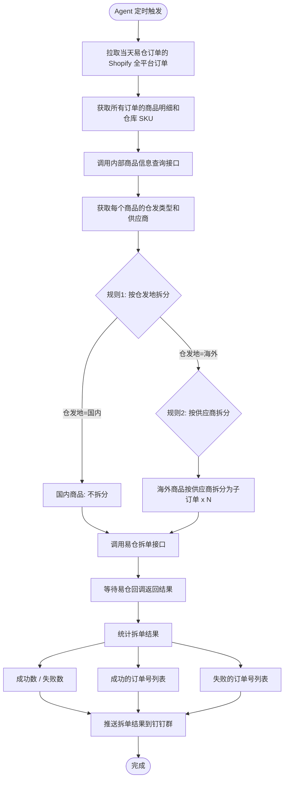

### Agent 执行流程说明

| 步骤 | 操作 | 说明 |
|-----|------|------|
| 1 | 定时拉取易仓订单 | 拉取当天易仓订单对应的 Shopify 全平台订单 |
| 2 | 获取商品明细 | 拿到所有订单的商品明细和仓库 SKU |
| 3 | 查询商品信息 | 调用内部接口，获取每个商品的仓发类型和供应商 |
| 4 | 按规则拆单 | 规则1：按仓发地拆分（国内/海外）；规则2：海外按供应商再拆 |
| 5 | 调用易仓拆单接口 | 将拆单结果同步给易仓 |
| 6 | 接收回调 | 接收易仓返回的拆单结果回调 |
| 7 | 统计结果 | 汇总成功数、失败数、成功/失败订单号列表 |
| 8 | 推送钉钉群 | 将拆单结果统计推送至钉钉群通知 |

### 国内发货子流程

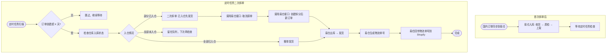

### 海外代发子流程（当前人工）

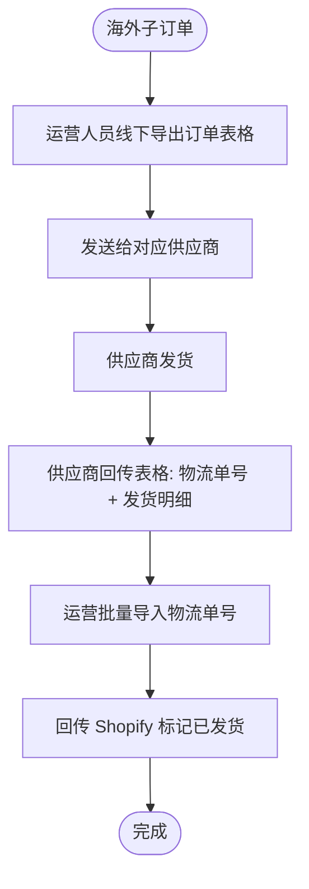

### 风险评估

| 风险点 | 说明 | 影响程度 |
|-------|------|---------|
| 依赖易仓拆单接口 | **已确认：易仓暂无拆单接口，需找易仓人员定制开发** | 高 |
| 定制开发周期 | 需与易仓沟通定制需求，周期和成本不可控 | 高 |
| 入库状态检查 | 需从易仓获取商品实际入库状态，依赖易仓 API 支持 | 中 |
| 海外订单 | 仍走人工，无改善 | 低 |

---

## 方案二：Agent 订阅消息 → 内部拆单 → 同步 Shopify → 易仓拉已拆订单

### 方案概述

- Agent 订阅 Shopify 订单创建 Webhook，收到消息后内部拆单
- 拆单结果（国内 + 海外）全部写回 Shopify
- 易仓统一从 Shopify 拉取所有订单
- 国内订单易仓正常发货，海外订单易仓手动标发

### 已知问题

- **拆单方式限制**：若直接拆 Shopify 原单，需取消原单并创建新订单，会导致：
  - 用户收到多次订单创建邮件，体验差
  - 原单退款流程出现问题（原单已取消，退款指向不明确）

### 主流程

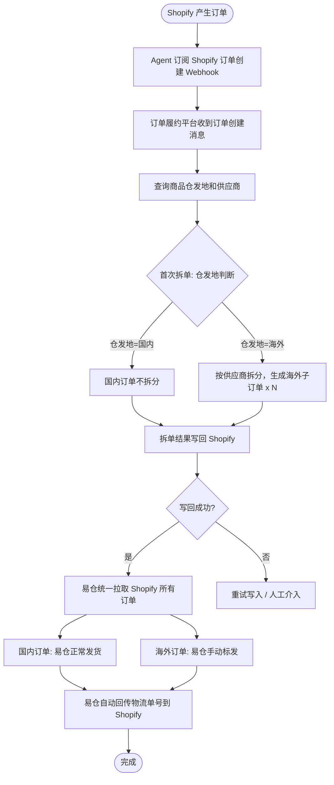

> **注意**：方案二不支持二次拆单（到仓时间拆分），因为易仓只从 Shopify 拉取一次订单，不支持二次拉取。

### 国内发货子流程

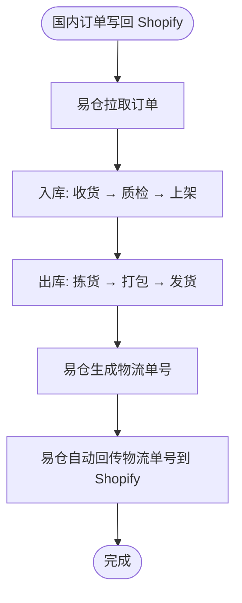

> **注意**：方案二不支持二次拆单（到仓时间拆分），因为易仓只从 Shopify 拉取一次订单，不支持二次拉取。如需到仓时间拆单能力，需选择方案一或方案三。

### 海外代发子流程

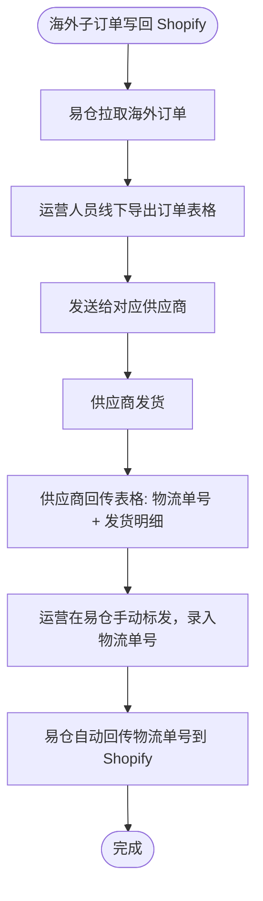

### 风险评估

| 风险点 | 说明 | 影响程度 |
|-------|------|---------|
| 拆单影响用户体验 | **取消原单+创建新单会触发多次订单创建邮件，用户体验差** | 高 |
| 原单退款问题 | **原单取消后退款指向不明确，可能导致退款流程异常** | 高 |
| 海外订单仍走人工 | 海外订单在易仓需手动标发，效率无改善 | 中 |

---

## 方案三：履约平台拉取订单 → Shopify fulfillmentOrderSplit 拆单 → 易仓发货 → 履约回写物流

### 方案概述

- 订单履约平台主动拉取 Shopify 新订单，按业务规则计算拆分方案
- 调用 Shopify `fulfillmentOrderSplit` API 在 Shopify 侧执行拆分
- 拉取最新 Shopify 订单结果，保存拆分后的订单
- 国内仓发货订单同步至易仓 ERP 处理发货
- 海外仓发货订单由履约平台支持标记发货
- 履约定时同步易仓发货状态，回写物流单号
- 调用 Shopify `fulfillmentCreateV` 回写物流信息，标记已发货

### 核心约束

> **⚠️ 所有拆单操作必须在订单履约平台完成，易仓 ERP 仅作为发货执行方，不允许操作拆单和合单。**

| 约束项 | 说明 |
|-------|------|
| 拆单权限 | **仅订单履约平台**有权执行拆单，易仓 ERP 不允许拆单 |
| 合单权限 | **易仓 ERP 不允许合单**，已拆分的子订单必须独立履约 |
| 易仓角色定位 | 易仓仅作为发货执行方：接收已拆分订单 → 入库 → 出库 → 发货 |
| 订单同步规则 | 履约平台同步到易仓的订单必须是**已拆分完成的子订单**，每个子订单独立存在 |
| 数据一致性 | Shopify 侧拆分结果、履约平台订单、易仓订单三者必须保持一致 |
| 二次拆单 | 二次拆单（到仓时间拆分）同样由履约平台发起，调用 Shopify `fulfillmentOrderSplit` 拆分后，取消易仓原单、推送新子订单到易仓 |

### ⚠️ 业务侧需提供：易仓订单操作清单

> **目的**：方案三要求所有拆单在履约平台完成，易仓不允许拆单/合单。需业务侧梳理在易仓内会对订单执行的所有操作，评估是否影响订单履约结果，以确定哪些操作需要禁止、哪些需要同步、哪些可放行。

**请业务侧填写以下表格：**

| 序号 | 操作名称 | 操作说明 | 操作频率 | 是否影响订单拆分结果 | 是否影响商品数量 | 是否影响物流信息 | 是否影响订单状态 | 风险等级建议 | 处置建议 |
|-----|---------|---------|---------|-------------------|----------------|----------------|----------------|------------|---------|
| 1 | 拆单 | 将一个订单拆分为多个子订单 | — | — | — | — | — | 🔴高 | 禁止 |
| 2 | 合单 | 将多个订单合并为一个订单 | — | — | — | — | — | 🔴高 | 禁止 |
| 3 | _待填写_ | _待填写_ | _待填写_ | _是/否_ | _是/否_ | _是/否_ | _是/否_ | _待评估_ | _待评估_ |
| 4 | _待填写_ | _待填写_ | _待填写_ | _是/否_ | _是/否_ | _是/否_ | _是/否_ | _待评估_ | _待评估_ |
| ... | ... | ... | ... | ... | ... | ... | ... | ... | ... |

**填写说明：**

| 列名 | 说明 |
|-----|------|
| 操作名称 | 易仓中该操作的功能名称 |
| 操作说明 | 具体做了什么（如：修改数量、取消订单、录入物流单号等） |
| 操作频率 | 日常高频 / 偶尔 / 仅异常时使用 |
| 是否影响订单拆分结果 | 操作后是否会改变订单的拆分结构（子订单数量、归属） |
| 是否影响商品数量 | 操作后是否会改变订单内商品的种类或数量 |
| 是否影响物流信息 | 操作后是否会改变物流单号、物流公司等信息 |
| 是否影响订单状态 | 操作后是否会改变订单状态（如：暂停、取消、完成） |
| 风险等级建议 | 🔴高（破坏数据一致性）/ 🟡中（需同步）/ 🟢低（无影响） |
| 处置建议 | 禁止 / 需同步到履约平台 / 可放行 |

**处置建议参考标准：**

| 风险等级 | 判定条件 | 处置方式 |
|---------|---------|---------|
| 🔴 **高风险** | 影响订单拆分结果 或 影响商品数量 | **禁止操作**：易仓关闭相关功能入口或限制权限 |
| 🟡 **中风险** | 影响物流信息 或 影响订单状态，但不影响拆分和数量 | **需同步**：操作后实时/定时同步变更到履约平台 |
| 🟢 **低风险** | 以上均无影响 | **可放行**：无需管控 |

### 主流程

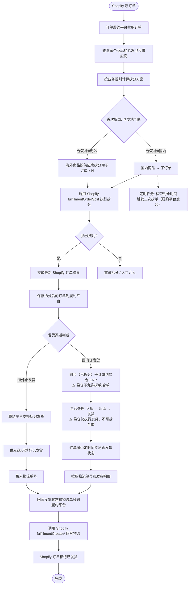

### 详细步骤说明

| 步骤 | 操作 | 说明 |
|-----|------|------|
| 1 | 拉取 Shopify 新订单 | 履约平台定时/订阅 Webhook 拉取 Shopify 新订单 |
| 2 | 查询商品信息 | 查询每个商品的仓发地属性（国内/海外）和供应商 |
| 3 | 计算拆分方案 | 按业务规则：国内商品归一组，海外商品按供应商拆分 |
| 4 | 调用 fulfillmentOrderSplit | **⚠️ 拆单仅在履约平台执行**，调用 Shopify API 拆分 |
| 5 | 拉取最新订单结果 | 拆分成功后，拉取 Shopify 最新订单数据 |
| 6 | 保存拆分后订单 | 将拆分后的子订单保存到履约平台数据库 |
| 7 | 同步到易仓 | **⚠️ 同步已拆分的子订单，易仓不允许拆单/合单** |
| 8 | 同步易仓发货状态 | 定时轮询易仓，获取国内订单的发货状态和物流单号 |
| 9 | 回写履约平台 | 将发货状态和物流单号更新到履约平台 |
| 10 | 调用 fulfillmentCreateV | 调用 Shopify API 回写物流信息，标记订单已发货 |

### fulfillmentOrderSplit 调用说明

**API**: `POST /admin/api/2024-01/graphql.json`

**核心逻辑**：
```graphql
mutation fulfillmentOrderSplit($fulfillmentOrderId: ID!, $fulfillmentOrderItems: [FulfillmentOrderItemInput!]!) {
  fulfillmentOrderSplit(fulfillmentOrderId: $fulfillmentOrderId, fulfillmentOrderItems: $fulfillmentOrderItems) {
    originalFulfillmentOrder { id status }
    remainingFulfillmentOrder { id status }
    fulfillmentOrder { id status }
    userErrors { field message }
  }
}
```

**拆分参数**：
- `fulfillmentOrderId`：原始履约订单 ID
- `fulfillmentOrderItems`：需要拆出的商品行及数量

**拆分结果**：
- `originalFulfillmentOrder`：拆分后留在原单的商品（已发货部分）
- `remainingFulfillmentOrder`：拆出的剩余商品（待发货部分）
- 每次拆分产生 1 个新子订单，多次拆分产生多个子订单

### fulfillmentCreateV 调用说明

**API**: `POST /admin/api/2024-01/graphql.json`

**核心逻辑**：
```graphql
mutation fulfillmentCreateV($fulfillment: FulfillmentV2Input!, $message: String) {
  fulfillmentCreateV(fulfillment: $fulfillment, message: $message) {
    fulfillment { id status trackingInfo { number company url } }
    userErrors { field message }
  }
}
```

**参数说明**：
- `fulfillment.lineItemsByFulfillmentOrder.fulfillmentOrderId`：履约订单 ID
- `fulfillment.trackingInfo`：物流单号、物流公司、物流追踪链接
- `fulfillment.notifyCustomer`：是否通知客户（建议 true）

### 国内发货子流程

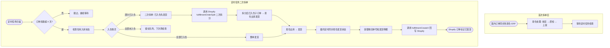

### 海外代发子流程（当前阶段 + 后续迭代）

```mermaid
flowchart TD
    subgraph S1 ["当前阶段-人工流程"]
    A([海外子订单]) --> B[运营人员线下导出订单表格]
    B --> C[发送给对应供应商]
    C --> D[供应商发货]
    D --> E[供应商回传表格: 物流单号 + 发货明细]
    E --> F[运营在履约平台标记发货，录入物流单号]
    F --> G[调用 fulfillmentCreateV 回写 Shopify]
    G --> H([Shopify 订单标记已发货])
    end

    subgraph S2 ["后续迭代-自动化流程"]
    A2([海外子订单]) --> B2[自动推送给供应商系统 API]
    B2 --> C2[供应商发货]
    C2 --> D2[供应商 API 回传物流单号]
    D2 --> E2[履约平台自动调用 fulfillmentCreateV]
    E2 --> F2([Shopify 订单标记已发货])
    end
```

### 风险评估

| 风险点 | 说明 | 影响程度 |
|-------|------|---------|
| fulfillmentOrderSplit 限制 | Shopify API 对拆分有频率限制和校验规则，需做异常处理 | 中 |
| 二次拆单依赖 | 需易仓支持取消原单 + 创建新订单（待确认） | 中 |
| 易仓拆合单管控 | **需关闭易仓自动拆合单功能**，确保易仓仅接收已拆分子订单并独立履约 | 高 |
| 轮询效率 | 定时轮询易仓发货状态，需合理设置轮询频率 | 低 |
| 海外自动化 | 依赖供应商系统对接能力，需逐家推进 | 中 |
| 开发工作量 | 履约平台需新增拆单逻辑、Shopify API 对接、易仓对接等模块 | 中 |

---

## 三方案对比总结

### 时序对比

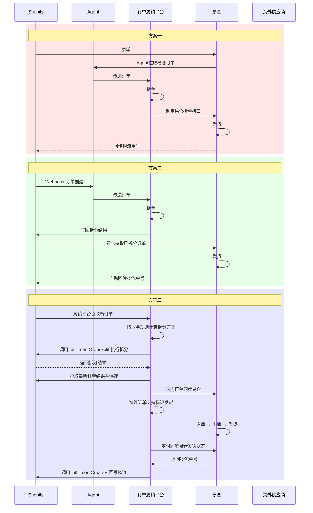

### 维度对比

| 维度 | 方案一 | 方案二 | 方案三 |
|------|-------|-------|-------|
| **拆单方式** | 易仓拆单接口（需定制） | 写回 Shopify 拆单 | Shopify fulfillmentOrderSplit API |
| **易仓对接** | **需定制拆单接口（已确认暂无）** | 易仓全量拉单，无法区分国内海外 | API 推自建订单（已有接口） |
| **易仓拆合单权限** | 易仓执行拆单 | 易仓不涉及拆单 | **⚠️ 易仓不允许拆单/合单** |
| **二次拆单能力** | 支持（需易仓取消原单+创建新单） | **不支持**（易仓只拉一次） | 支持（Shopify fulfillmentOrderSplit 二次拆分） |
| **用户体验** | 无影响 | **差（多次邮件、退款异常）** | 无影响（Shopify 原生拆单，不触发邮件） |
| **竞态风险** | 低 | 低 | 低 |
| **物流回传** | 易仓自行回传 Shopify | 易仓自动回传 Shopify | 履约平台调用 fulfillmentCreateV 回传 |
| **对易仓的依赖** | 重（依赖定制接口） | 重（全量拉单无法控制） | 中（需取消原单+创建新单能力） |
| **自主可控** | 低 | 低 | 高（履约平台统一管控） |
| **海外订单** | 仍人工 | 仍人工 | 平台接管，可迭代自动化 |
| **改动范围** | 小（但依赖外部） | 中 | 大 |
| **后续扩展性** | 差 | 差 | 强 |

---

## 待确认事项

| 序号 | 事项 | 影响方案 | 状态 |
|-----|------|---------|------|
| 1 | 易仓暂无拆单接口，需找易仓人员定制开发 | 方案一 | **已确认：需定制** |
| 2 | 易仓按全量订单拉取，无法区分国内海外 | 方案二 | **已确认：存在限制** |
| 3 | 拆 Shopify 原单会导致多次邮件和退款问题 | 方案二 | **已确认：体验差** |
| 4 | 易仓关闭自动拉单是否可行 | 方案三 | 已确认：暂定可行 |
| 5 | 易仓是否支持取消原单 + 创建新订单（二次拆单依赖） | 方案一、方案三 | 待确认 |
| 6 | 易仓 API 是否支持查询订单物流单号和发货状态 | 方案三 | 待确认 |
| 7 | 海外供应商 API 对接能力调研 | 方案三后续迭代 | 待确认 |
| 8 | **⚠️ 易仓关闭自动拆合单功能** | 方案三 | **已确认：不允许拆单/合单** |
