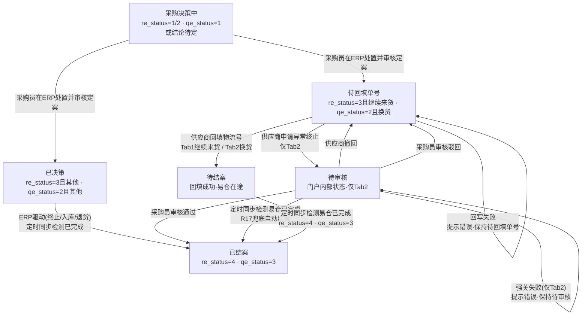
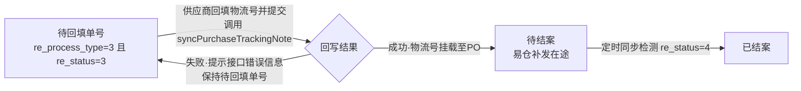
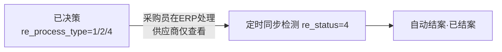
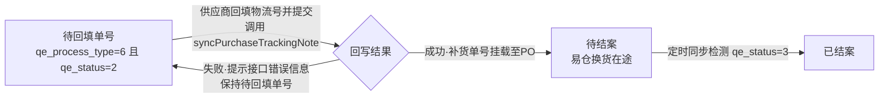
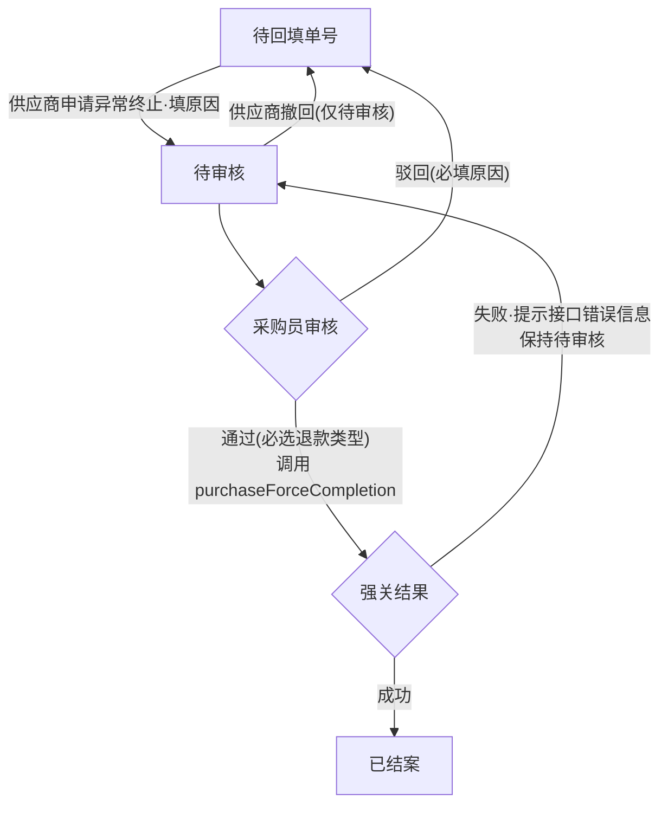

# 采购异常协作迭代PRD

| 项目名称 | 供应商门户 - 采购异常协作模块 | 版本号 | V1.0 |
| :--- | :--- | :--- | :--- |
| 文档状态 | 草稿 | 编写人 | - |
| 适用角色 | 采购员、供应商 | 最后更新 | 2026-09-01 |

---

## 一、变更背景

在现有供应商门户基础上新增"采购异常协作"模块，将易仓ERP中质检异常和收货异常数据同步至门户。收货差异的处置决策由采购员在ERP完成，供应商仅在门户执行"补发物流号回填"等后续动作；质检异常由供应商回填物流号或发起异常终止申请。目标：解决物流单号回填不及时、PO长期挂账的问题。

---

## 二、功能变更清单

| 序号 | 功能模块 | 所属平台 | 功能简述 | 优先级 |
| :--- | :--- | :--- | :--- | :--- |
| 1 | 采购异常列表（双Tab） | 供应商门户 | 新增一级菜单，Tab1收货差异 + Tab2质检异常，列表行内展开明细 | P0 |
| 2 | 供应商回填物流号 | 供应商门户 | 采购决策为"补发/换货"时，回填物流单号 | P0 |
| 3 | 异常终止申请（仅Tab2） | 供应商门户 | QC异常供应商无法履约时申请终止 | P0 |
| 4 | 列表操作列审核（仅Tab2） | 供应商门户 | 待审核状态显示审核按钮，审核QC异常终止申请、选择退款类型，通过后强关采购单 | P0 |
| 5 | 异常数据同步 | 订单履约平台 | 定时从易仓ERP拉取异常数据及采购决策结果 | P0 |
| 6 | API回写易仓 | 订单履约平台 | 供应商回填后同步物流号至PO；终止审核通过后强关采购单 | P0 |

---

## 三、业务流程

### 3.1 总体业务链路


### 3.2 门户状态定义

系统维护两套状态字段，用于解耦门户展示态与易仓单据态：

- **`portal_status`（门户展示态）**：门户内部流转的状态，供供应商/采购员理解与操作。
- **`ec_raw_status`（易仓单据态）**：易仓侧单据的原始状态（`re_status`/`qe_status`），通过定时同步抓取，不直接由门户控制。

> **语义化协作状态**：为消除供应商对"待处理"状态的歧义，门户采用语义化的「协作状态」进行展示。原"待处理"态按「采购决策结果」拆分为三个语义态——**采购决策中 / 待回填单号 / 已决策**，让供应商一眼看清当前流程归属（等待决策 / 需要自己操作 / 决策已定无需操作）。

| 门户状态（portal_status） | 颜色 | 准入条件（易仓状态 ec_raw_status） | 业务定义 | 供应商可见操作 |
| :--- | :--- | :--- | :--- | :--- |
| **采购决策中** | 灰色 | Tab1：`re_status=1`（未处理）或 `re_status=2`（已确认，采购员处置中未定案）；Tab2：`qe_status=1`（未处理）或（`qe_status=2` 且结论待定） | 异常已同步，采购员在易仓尚未审核定案 | 仅查看 |
| **待回填单号** | 橙色 | Tab1：`re_status=3`（已审核）且结论=继续来货（`re_process_type=3`）；Tab2：`qe_status=2`（已确认）且结论=换货（`qe_process_type=6`） | 采购员已定案需供应商补发，供应商需回填物流单号 | 回填物流号（Tab2 额外支持发起异常终止申请） |
| **已决策** | 蓝色 | Tab1：`re_status=3`（已审核）且结论=终止/退货/入库等（`re_process_type=1/2/4`）；Tab2：`qe_status=2`（已确认）且结论=退回/销毁/不良品上架等（`qe_process_type≠0/6`） | 决策已定，无需供应商后续操作 | 仅查看 |
| **待审核** | 蓝色 | 门户内部状态（仅Tab2） | 供应商已提交"异常终止申请"（仅Tab2），等待采购员审批 | 撤回申请、查看理由 |
| **待结案** | 青色 | 门户内部状态 | 供应商已完成补发物流号回填（`syncPurchaseTrackingNote` 回写成功），易仓侧补发/换货流程进行中、尚未到终态，等待定时同步检测易仓完成后自动结案 | 仅查看 |
| **已结案** | 绿色 | `re_status=4`（已完成）；`qe_status=3`（已完成） | 易仓侧单据已完成，门户任务关闭 | 查看处理历史 |

> **关于回写接口失败**：与易仓交互的两个回写接口（`syncPurchaseTrackingNote`、`purchaseForceCompletion`）**以接口返回成功为准才改变单据状态**——**回填物流号成功 → 进入「待结案」**（此时易仓侧尚未完成，补发/换货在途，待定时同步检测到终态后自动结案，见 R17）；**强关成功 → 直接进入「已结案」**（强关即易仓终态）。失败 → 弹出提示接口返回的错误信息（`message`），单据不流转、保持原状态（「待回填单号」/「待审核」），可重新操作。因此协作状态不设「同步中」「同步失败」两态。「定时拉取易仓数据失败」同样不改变协作状态，仅记录日志支持手动重试同步（见 4.1.3 更新异常数据）。

> **说明**：Tab1 收货差异的决策由采购员在ERP完成，决策结果（继续来货/终止来货/入库/退货）通过 `re_process_type` 字段同步至门户。**回填物流单号按钮的显示条件：`re_process_type=3`（继续来货）且 `re_status=3`（已审核）**——`re_status=1/2` 时采购员尚未审核定案，门户不推进；`re_status=3` 表示采购员已审核定案，供应商才进入「待回填单号」。其余决策（终止来货/入库/退货）供应商仅查看，等待ERP完成自动结案。单价不一致类型（`re_price_status≠0`）不在门户处理，由采购员在ERP处理。

### 3.3 异常协作状态流转

**门户状态机总览（6态流转）：**



**Tab1 收货差异 - 供应商回填物流号（决策=继续来货）：**



**Tab1 收货差异 - ERP驱动（决策=终止来货/入库/退货）：**



**Tab2 质检异常 - 供应商回填物流号（决策=换货）：**



**Tab2 质检异常 - 异常终止申请：**



---

## 四、功能详细设计

### 4.1 采购异常列表（供应商门户）

#### 4.1.1 菜单位置

在供应商门户顶部导航新增一级菜单「采购异常」，点击后展示异常列表页。

#### 4.1.2 双Tab架构

为了兼容易仓异构API规范，门户采用统一入口、双Tab展现形式：

**Tab 1：收货差异处理（Quantity/Price）**
- **业务逻辑**：同步执行。由采购员在 ERP 完成差异决策，供应商执行后续动作。
- **核心操作**：
  - 若结论为"继续来货"：供应商需回填补发物流单号。
  - 若结论为"终止来货/入库/退货"：供应商仅可查看，无需操作。
- **后端API**：`abnormalReceiptList`（查询）/ `syncPurchaseTrackingNote`（回写补发信息）。
- **规范**：全局使用 `snake_case`（蛇形命名）。

**Tab 2：质检异常协同（Quality/QC）**
- **业务逻辑**：执行反馈，回填采购已决策的补货单号。
- **核心操作**：补发物流号回填、异常终止申请。
- **后端API**：`qcReceiptList`（查询）/ `syncPurchaseTrackingNote`（回写）。
- **规范**：全局使用 `CamelCase`（小驼峰命名）。
- **增强特征**：支持查看 `product_img` 商品图片及采购处理备注。

**异构接口对齐表：**

| 异常分类（门户Tab） | 接口规范 | 查询接口 | 供应商回写接口 | 回写目标 |
| :--- | :--- | :--- | :--- | :--- |
| 收货差异处理 | `snake_case` | `abnormalReceiptList` | `syncPurchaseTrackingNote` | 采购单跟踪备注（补发物流号） |
| 质检异常协同 | `CamelCase` | `qcReceiptList` | `syncPurchaseTrackingNote` | 采购单跟踪备注（补货单号） |

> **Tab 数量统计**：每个 Tab 标签旁以徽标展示该 Tab 异常单数量（收货差异处理 / 质检异常协同），随列表筛选条件实时刷新，展示当前筛选条件下各 Tab 的异常单数；未筛选时展示该 Tab 全部异常单数。

#### 4.1.3 列表展示

**列表结构（主从表）：** 列表主行为「异常单」维度（一条收货单/质检单对应一条主记录），一个异常单下可能挂多个异常商品明细。点击主行展开箭头，展示该单下的商品级异常明细。

**筛选条件：**

| 筛选项 | 类型 | 说明 |
| :--- | :--- | :--- |
| 协作状态 | 下拉单选 | 采购决策中/待回填单号/已决策/待审核/待结案/已结案 |
| 单据号 | 文本输入 | 支持收货单号 / 参考号 / 内部采购单号 / 内部采购订单号 模糊搜索（四单号海选） |
| 商品搜索 | 文本输入 | 支持货号 / SKU / SPU 模糊搜索 |
| 时间筛选 | 下拉单选 + 日期范围 | 时间类型下拉（创建时间/更新时间/操作时间）+ 开始时间~结束时间，默认按创建时间 |

**主行字段（单据级）：**

| 字段名 | 说明 |
| :--- | :--- |
| 异常单号 | Tab1 收货单号 `receiving_code` / Tab2 入库单号 `receiving_code` |
| 供应商 | 供应商名称 |
| 参考号 | 易仓采购单号 `po_code`（供应商门户统一命名为「参考号」） |
| 内部采购单号 | 订单履约平台内部采购单号（自有单号体系） |
| 内部采购订单号 | 供应商门户侧采购订单号（自有单号体系） |
| 采购决策（关键字段） | Tab1：继续来货/终止来货/入库/退货（`re_process_type`）；Tab2：换货/退回/销毁等（`qe_process_type`）。采购员在 ERP 决策后，`re_process_type` 随定时同步任务（每 15 分钟增量拉取，支持手动触发更新）拉取最新值，门户据此推进「采购决策中→待回填单号/已决策」。当单据已回填物流号（进入「待结案/已结案」，或回写失败保留在「待回填单号」）时，决策文案下方以灰色小字展示物流单号（供应商回填的补发物流号），与决策结果强关联，不新增列 |
| 异常商品数 | 该异常单下 `details` 明细数量 |
| 异常类型（仅 Tab1） | 比预期多（`re_type=0`）/ 比预期少（`re_type=1`） |
| 协作状态 | 采购决策中/待回填单号/已决策/待审核/待结案/已结案 |
| 创建时间 | 易仓创建时间：Tab1 `re_add_time` / Tab2 `qe_add_time` |
| 更新时间 | 易仓更新时间：Tab1 `re_update_time` / Tab2 `qe_update_time` |
| 操作时间 | 门户最近一次操作时间（供应商回填物流号、申请终止、撤回申请，采购员审核通过/驳回等），为门户本地字段；该异常单无门户操作时显示为空 |
| 操作 | 展开明细/回填物流号/申请终止/审核/撤回申请（按钮随协作状态与角色动态展示，详见 4.5 按钮权限表）/操作日志（所有状态可见） |

> **单号说明**：异常数据源来自易仓 ERP，接口仅返回易仓采购单号 `po_code`。列表展示的「内部采购单号」「内部采购订单号」为订单履约平台 / 门户自有单号体系，与易仓 `po_code` 不同。易仓采购单由门户采购订单填写物流单号后同步过去，履约平台的「入库通知」持有 `po_code` 与门户内部采购单/采购订单的关联关系，列表据此带出内部单号。易仓 `po_code` 作为主行「参考号」列展示。

**展开明细字段（商品级）：**

**Tab 1 - 收货差异明细：**

| 字段名 | 说明 |
| :--- | :--- |
| 商品信息 | 商品图片 `product_img`（支持悬停放大）、商品名称、货号、SKU编码（`product_barcode`）、SPU、属性（颜色/尺码）（货号/SPU/颜色/尺码由 SKU 编码解析生成） |
| 预期数量 | `receiving_quantity` |
| 实际收货数量 | `received_quantity` |
| 差异数量 | 多发/少发数量 |

**Tab 2 - 质检异常明细：**

| 字段名 | 说明 |
| :--- | :--- |
| 商品信息 | 商品图片 `product_img`（支持悬停放大）、商品名称 `product_title`、货号、SKU编码 `product_barcode`、SPU、属性（颜色/尺码）（货号/SPU/颜色/尺码由 SKU 编码解析生成） |
| 送检数量 | `qc_quantity` |
| 实收数量 | `qc_received_quantity` |
| 问题数量 | `qc_quantity_unsellable` |
| 不合格项 | `quality_control_result` |
| 处理类型 | 换货/退回/销毁等（`qe_process_type`） |
| 备注 | `qe_desc` |
| 物流单号 | `logistics_tracking_number`（仅退回/换货时展示） |

**排序规则：** 默认按创建时间倒序

**分页规则：** 默认每页20条，支持切换50/100条（分页按「异常单」维度，不按商品明细维度）

**导出功能：**
- 列表顶部提供「导出」按钮，按当前筛选条件导出异常列表数据，导出维度为**商品维度**：每条商品明细一行，单据级字段重复携带（主从表展平）。
- 点击「导出」弹出确认弹窗，确认文案「确认导出当前筛选下的「收货差异/质检异常」数据？」，点击「确认导出」后执行导出；点击「取消」不导出。
- **双 Tab 使用各自独立的导出列模板**（Tab1 收货差异 / Tab2 质检异常），字段如下表。
- 导出前必须经过权限校验；无导出权限的账号，按钮置灰或隐藏。
- 单次导出默认最大 10000 行（按导出文件行数计算），超出需缩小筛选范围后分批导出。
- **导出不记录操作日志**（业务方明确要求，覆盖全局「导出需记录审计日志」规范）。
- 供应商账号仅能导出自己供应商代码关联的数据。

**更新异常数据：**
- 列表顶部提供「更新异常数据」按钮，手动触发增量拉取易仓最新异常数据（不受每 15 分钟定时同步影响）。
- 点击「更新异常数据」弹出确认弹窗，确认后执行；同步期间按钮置灰/Loading，防止重复触发。

**导出字段（商品维度，一行 = 一条商品明细）：**

**单据级公共字段（两 Tab 均含，每条明细重复携带）：**

| 字段 | 说明 |
| :--- | :--- |
| 异常单号 | Tab1 收货单号 / Tab2 入库单号 |
| 供应商 | 供应商名称 |
| 参考号 | 易仓采购单号 `po_code` |
| 内部采购单号 | 订单履约平台内部采购单号 |
| 内部采购订单号 | 供应商门户采购订单号 |
| 采购决策 | Tab1：继续来货/终止来货/入库/退货；Tab2：换货/退回/销毁等 |
| 协作状态 | 采购决策中/待回填单号/已决策/待审核/待结案/已结案 |
| 异常类型（仅 Tab1） | 比预期多（`re_type=0`）/ 比预期少（`re_type=1`） |
| 创建时间 | 易仓创建时间 |
| 更新时间 | 易仓更新时间 |
| 操作时间 | 门户最近操作时间（无操作时为空） |

**Tab1 收货差异 - 商品字段：**

| 字段 | 说明 |
| :--- | :--- |
| 商品图片链接 | 商品图片 URL，可点击预览，不导出图片本体 |
| 商品名称 | `product_title` |
| 货号 | 由 SKU 编码解析生成 |
| SKU编码 | `product_barcode` |
| SPU | 由 SKU 编码解析生成 |
| 属性 | 颜色/尺码，由 SKU 编码解析生成 |
| 预期数量 | `receiving_quantity` |
| 实际收货数量 | `received_quantity` |
| 差异数量 | 多发/少发数量 |
| 物流单号 | 供应商回填的补发物流单号（单据级字段，仅「继续来货」场景回填后非空，每条明细重复携带） |

**Tab2 质检异常 - 商品字段：**

| 字段 | 说明 |
| :--- | :--- |
| 商品图片链接 | 商品图片 URL，可点击预览，不导出图片本体 |
| 商品名称 | `product_title` |
| 货号 | 由 SKU 编码解析生成 |
| SKU编码 | `product_barcode` |
| SPU | 由 SKU 编码解析生成 |
| 属性 | 颜色/尺码，由 SKU 编码解析生成 |
| 送检数量 | `qc_quantity` |
| 实收数量 | `qc_received_quantity` |
| 问题数量 | `qc_quantity_unsellable` |
| 不合格项 | `quality_control_result` |
| 处理类型 | 换货/退回/销毁等（`qe_process_type`） |
| 备注 | `qe_desc` |
| 物流单号 | `logistics_tracking_number`（仅退回/换货时非空） |

**操作日志：**

- 每个异常单（Tab1/Tab2）提供「操作日志」入口，所有协作状态下均可点击查看，弹出该异常单的全量操作日志。
- 日志内容覆盖四类操作：
  1. **创建**：易仓同步生成异常单、首次全量落库；
  2. **更新**：定时拉取全量覆盖更新、状态流转（决策同步、回写成功/失败、自动结案（标记「外部同步」）等）；
  3. **供应商所有操作**：回填物流号、申请异常终止、撤回申请；
  4. **采购员所有操作**：采购决策（处置结果确认）、终止申请审核通过/驳回。
- 每条日志记录：操作时间、操作人（系统/采购员/供应商）、操作动作、详情（单号、终止原因、退款类型等关键信息）。
- 日志按时间倒序展示；仅查看，不支持编辑/删除（对应业务规则 R13）。
- 查看权限：供应商仅可查看自己供应商代码关联异常单的日志（R1 数据隔离），采购员可查看全部；无查看权限时按钮隐藏（对应 4.5 按钮权限表）。

#### 4.1.4 数据隔离

权限逻辑与采购订单模块一致：

- 按供应商账号做数据隔离，供应商仅能查看和操作自己名下（`supplier_code` 关联）的异常数据，无法查看其他供应商的异常。
- 数据隔离实现：查询接口的**请求参数**无 `supplier_code`（仅有 `suppiler_id`/`suppilerId`），无法在查询时按供应商过滤；但**返回参数**直接返回 `supplier_code`（供应商代码），故按返回结果中的 `supplier_code` 直接隔离。当个别记录 `supplier_code` 缺失时，兜底通过易仓 SKU（`product_barcode`）在履约平台反查供应商。

---

### 4.2 列表行内展开详情（供应商门户）

> **设计决策**：不设独立详情页。异常单信息量小、任务导向强，供应商以列表为工作台，点击行即可在列表内展开商品明细，无需跳转，避免打断批量处理节奏。

**展开明细承载内容：**

| 区块 | 承载方式 | 说明 |
| :--- | :--- | :--- |
| 基本信息（异常单号/采购单号/供应商/采购决策/协作状态/时间信息） | 列表主行列 | 已作为列表列展示，不重复展开；时间信息含创建/更新/操作三类时间 |
| 商品明细 | 点击行展开 | 商品图片（支持悬停放大）、商品名称、货号/SKU/SPU、属性（颜色/尺码）、数量、差异/问题数量、不合格项、处理类型，字段见 4.1.3「展开明细字段」 |
| 处理信息（采购员姓名/退回运费/备注） | 展开区或「操作日志」 | 低频字段，随处理结果展示，不作为独立页 |

**图片查看**：展开明细中的商品缩略图支持悬停放大查看，无需进入独立详情页（对应业务规则 R12）。

---

### 4.3 供应商处理操作（供应商门户）

#### 4.3.1 Tab 1 - 收货差异回填物流号

**适用场景：** 收货异常，采购员在ERP决策为"继续来货"（`re_process_type=3`）且已审核定案（`re_status=3`）

**业务逻辑：**
- 采购员在ERP判定供应商少发，决定"继续来货"
- 供应商在门户回填补发物流单号
- 系统将物流号同步至PO跟踪记录

**回填弹窗：**

弹窗顶部只读展示该收货单下全部「少发」商品明细（商品图、SKU、预期数量、实际收货数量、少发数量），供应商确认补发范围后，填写单据级物流信息：

| 字段名 | 是否必填 | 类型 | 说明 |
| :--- | :--- | :--- | :--- |
| 物流单号 | 是 | 文本输入 | 补发货物的物流单号（`tracking_note_record.tracking_no`） |
| 运输方式 | 是 | 下拉单选 | `supplier_method_id`：1-自提 2-快递 3-物流 4-送货 |
| 承运商 | 是 | 下拉单选 | `purchase_shipper_id`，前端打开弹窗时调用易仓 `getPurchaseShipper` 接口动态拉取（`ps_name` 为 Label、`ps_id` 为 Value） |
| 补发运费 | 否 | 数字输入 | 补发产生的运费（元） |

**提交规则：**
- 物流单号、运输方式、承运商必填
- 提交后系统调用 `syncPurchaseTrackingNote` 将物流号同步至PO，调用期间「提交」按钮 Loading 锁定，防止重复提交
- **接口返回成功后**，状态变为"待结案"（易仓补发在途），待定时同步检测到易仓已完成（`re_status=4`）后自动结案（见 R17）
- **接口返回失败时**，弹出提示接口返回的错误信息（`message`），单据不流转、状态保持"待回填单号"，可修改物流号后重新提交

**API回写逻辑：**

| 操作 | 调用接口 | 关键参数 |
| :--- | :--- | :--- |
| 回填物流号 | `syncPurchaseTrackingNote` | `po_code`、`tracking_note_record.tracking_no`、`supplier_method_id`、`purchase_shipper_id` |

---

#### 4.3.2 Tab 1 - 收货差异ERP驱动场景（仅查看）

**适用场景：** 采购员在ERP决策为"终止来货/入库/退货"的收货异常

**处理方式：** 由采购员在易仓ERP直接完成，供应商门户仅展示决策结果

**展示字段（只读）：**

| 字段名 | 说明 |
| :--- | :--- |
| 采购决策 | 终止来货（`re_process_type=4`）/ 入库（1）/ 退货（2） |
| 承担方 | 供应商/我方（`re_assumer`） |
| 协作状态 | 已决策/已结案 |

**自动结案逻辑：**
- 系统定时同步时，检查易仓侧该异常是否已推进到"已完成"（`re_status=4`）
- 若已推进，门户任务自动转为"已结案"，展示处理结果
- 供应商无需任何操作，仅查看

---

#### 4.3.3 Tab 2 - 质检异常回填物流号

**适用场景：** 质检异常，采购员在ERP决策为"换货"（`qe_process_type=6`）且已确认（`qe_status=2`）

**业务逻辑：**
- 采购员在ERP判定需要供应商换货
- 供应商在门户回填物流号
- 系统将单号同步至PO跟踪记录

**回填弹窗：**

弹窗顶部只读展示该质检单下全部「换货」商品明细（商品图、SKU、问题数量、不合格项），供应商确认补发范围后，填写单据级物流信息：

| 字段名 | 是否必填 | 类型 | 说明 |
| :--- | :--- | :--- | :--- |
| 物流单号 | 是 | 文本输入 | 补发货物的物流单号（`tracking_note_record.tracking_no`） |
| 运输方式 | 是 | 下拉单选 | `supplier_method_id`：1-自提 2-快递 3-物流 4-送货 |
| 承运商 | 是 | 下拉单选 | `purchase_shipper_id`，前端打开弹窗时调用易仓 `getPurchaseShipper` 接口动态拉取（`ps_name` 为 Label、`ps_id` 为 Value） |
| 补发运费 | 否 | 数字输入 | 补发产生的运费（元） |

> 说明：一个质检单对应一个采购单（PO），多个换货 SKU 打包一个包裹补发，故仅需填写一个物流单号，一次调用 `syncPurchaseTrackingNote` 同步至 PO 跟踪记录。

**提交规则：**
- 物流单号、运输方式、承运商必填
- 提交后系统调用 `syncPurchaseTrackingNote`，调用期间「提交」按钮 Loading 锁定，防止重复提交
- **接口返回成功后**，状态变为"待结案"（易仓换货在途），待定时同步检测到易仓已完成（`qe_status=3`）后自动结案（见 R17）
- **接口返回失败时**，弹出提示接口返回的错误信息（`message`），单据不流转、状态保持"待回填单号"，可修改物流号后重新提交

**API回写逻辑：**

| 操作 | 调用接口 | 关键参数 |
| :--- | :--- | :--- |
| 回填物流号 | `syncPurchaseTrackingNote` | `po_code`、`tracking_note_record.tracking_no`、`supplier_method_id`、`purchase_shipper_id` |

**增强特征：**
- 支持查看 `product_img` 商品图片（悬停放大）
- 展示采购处理备注 `qe_desc`
- 展示不合格项 `quality_control_result`

---

#### 4.3.4 Tab 2 - 异常终止申请

**适用场景：** 仅Tab2质检异常，供应商无法履约，需申请终止

**表单字段：**

| 字段名 | 是否必填 | 类型 | 说明 |
| :--- | :--- | :--- | :--- |
| 终止原因 | 是 | 文本输入 | 必须说明终止原因（如：没货了、不生产了等） |

**提交规则：**
- 提交后状态变为"待审核"
- 暂不回写易仓ERP，等待采购员审核
- 采购员审核通过后，系统调用 `purchaseForceCompletion` 强关采购单（调用期间「审核通过」按钮 Loading 锁定，防止重复提交）；**强关成功→"已结案"，强关失败→弹出提示接口返回的错误信息（`message`）、单据不流转保持"待审核"**
- 供应商可在"待审核"状态下撤回申请，撤回后状态回退到"待回填单号"（点击「撤回申请」弹出确认提示框，确认后撤回）

**API回写逻辑：**

| 操作 | 调用接口 | 关键参数 |
| :--- | :--- | :--- |
| 终止审核通过 | `purchaseForceCompletion` | `po_code`、`refund_type` |

---

### 4.4 采购员审核（门户列表操作列）

> 仅服务 Tab2 质检异常的"异常终止申请"。Tab1 收货差异的终止来货由采购员直接在ERP操作，不走门户审核流程。

#### 4.4.1 审核入口

在供应商门户「采购异常」列表（Tab2 质检异常）的操作列中增加「审核」按钮，**仅当协作状态为「待审核」时显示**。点击「审核」弹出审核弹窗，在弹窗内执行审核。

**审核弹窗信息（只读展示）：**

| 字段 | 说明 |
| :--- | :--- |
| 质检单号 | `qc_code` |
| 供应商名称 | 申请供应商 |
| 终止原因 | 供应商申请终止时填写的原因 |
| 涉及商品 | 商品名称、SKU 及数量 |

**操作列规则：**
- 待审核状态操作列按角色显示：供应商角色显示「撤回申请」；采购员角色显示「审核」
- 点击「审核」弹出审核弹窗，在弹窗内选择「审核通过」/「审核驳回」

#### 4.4.2 审核操作

**审核通过：**

| 字段名 | 是否必填 | 类型 | 说明 |
| :--- | :--- | :--- | :--- |
| 退款类型 | 是 | 下拉单选 | 1-只退还货款；2-退还货款+税金+运费（默认）；3-退还货款+税金+运费+退回运费；4-退回货款+税金 |
| 备注 | 否 | 文本输入 | 审核备注 |

**审核通过后API联动：**

1. 调用 `purchaseForceCompletion` 强制完成采购单（QC异常无对应处理接口，直接强关），调用期间「审核通过」按钮 Loading 锁定，防止重复提交
2. **接口返回成功后** → 状态变为"已结案"
3. **接口返回失败时** → **弹出提示接口返回的错误信息（`message`）**，**异常单据不流转，状态保持"待审核"**，采购员可重新打开审核弹窗再次审核

**审核驳回：**

| 字段名 | 是否必填 | 类型 | 说明 |
| :--- | :--- | :--- | :--- |
| 驳回原因 | 是 | 文本输入 | 必须填写驳回原因 |

**驳回后状态流转：**
- 异常单状态回退为"待回填单号"
- 供应商可重新操作（回填物流号或重新申请终止）

---

### 4.5 按钮权限表

> 依据全局约束：所有新增按钮必须配置权限控制，无权限时按钮置灰或隐藏。模型为 RBAC，按角色控制按钮可操作性。

| 按钮名称 | 位置 | 显示条件 | 权限控制 |
| :--- | :--- | :--- | :--- |
| 展开明细 | 列表主行展开箭头 | 所有协作状态 | 供应商、采购员 |
| 回填物流号 | Tab1 操作列 | 协作状态=待回填单号 且 决策=继续来货 且 已审核（`re_status=3`） | 供应商 |
| 回填物流号 | Tab2 操作列 | 协作状态=待回填单号 且 决策=换货 且 已确认 | 供应商 |
| 申请终止 | Tab2 操作列 | 协作状态=待回填单号 且 决策=换货 且 已确认 | 供应商 |
| 撤回申请 | Tab2 操作列 | 协作状态=待审核 | 供应商 |
| 审核 | Tab2 操作列 | 协作状态=待审核 | 采购员（审核弹窗内的「审核通过」「审核驳回」为审核操作的确认动作，随「审核」按钮权限） |
| 操作日志 | 操作列（Tab1/Tab2） | 所有协作状态 | 供应商、采购员（供应商仅查看自己数据的日志，采购员可查看全部） |
| 导出 | 列表顶部 | 始终 | 供应商（R18 导出权限校验） |
| 更新异常数据 | 列表顶部 | 始终 | 供应商、采购员 |

---

## 五、业务规则

| 编号 | 规则类型 | 规则描述 |
| :--- | :--- | :--- |
| R1 | 数据隔离 | 供应商仅能查看和操作自己名下关联的异常数据，权限逻辑与采购订单模块一致。供应商归属以接口返回的 `supplier_code` 直接确定，缺失时兜底通过易仓 SKU（`product_barcode`）反查 |
| R2 | 状态互斥 | 异常单同一时间只能处于一种状态：采购决策中/待回填单号/已决策/待审核/待结案/已结案 |
| R3 | 操作限制 | 待回填单号状态才允许供应商操作（回填物流号，Tab2 额外支持申请异常终止）；待审核状态仅允许撤回申请（仅Tab2）；采购决策中/已决策/待结案/已结案状态为只读 |
| R4 | 决策前置 | 收货差异的处置决策由采购员在ERP完成；回填物流号按钮仅在 `re_process_type=3`（继续来货）且 `re_status=3`（已审核，采购员定案）时显示 |
| R5 | 回填必填 | 供应商回填物流号时，物流单号、运输方式、承运商为必填项 |
| R6 | 终止申请 | Tab2供应商申请异常终止时，必须填写终止原因 |
| R7 | 审核校验 | 采购员审核通过时，必须选择退款类型；驳回时必须填写驳回原因 |
| R8 | API回写 | 供应商回填物流号后，系统调用 syncPurchaseTrackingNote；**接口返回成功才将状态变为"待结案"**（易仓补发/换货在途），待定时同步检测到易仓已完成（`re_status=4`/`qe_status=3`）后自动结案；失败则弹出提示接口返回的错误信息（`message`）、单据保持"待回填单号"，可修改物流号后重新提交 |
| R9 | 强关联动 | Tab2终止审核通过后，系统调用 purchaseForceCompletion 强关采购单；**接口返回成功才将状态变为已结案**，强关失败不流转、单据保持待审核（见R10） |
| R10 | 强关失败 | 若强关接口失败，弹出提示接口返回的错误信息（`message`），异常单据不流转、状态保持"待审核"，采购员可重新审核 |
| R11 | 同步频率 | 异常数据每15分钟从易仓ERP增量拉取一次，支持手动触发更新异常数据 |
| R12 | 图片展示 | 列表展开明细中的商品缩略图必须支持悬停放大功能（不设独立详情页） |
| R13 | 审计日志 | 所有操作（供应商回填物流号、申请终止、撤回申请、采购员采购决策、终止申请审核通过/驳回、API回写、系统同步更新）需记录操作日志；列表「操作日志」可查看全量日志（操作时间、操作人、动作、详情），日志仅查看不可编辑/删除 |
| R14 | 撤回申请 | Tab2待审核状态下，供应商可撤回终止申请，撤回后状态回退到待回填单号 |
| R15 | 退货自动结案 | 决策为"退货"的异常单，当同步发现易仓侧单据状态已推进到终态（`re_status=4` 已完成）时，门户任务自动转为"已结案"；**按单据状态判定，无其他附加条件** |
| R16 | 入库/终止自动结案 | 决策为"入库/终止来货"的异常单，当同步发现易仓侧单据状态已推进到终态（`re_status=4` 已完成）时，自动结案；**按单据状态判定，无其他附加条件** |
| R17 | 心跳自动结案（兜底） | 定时同步时若发现易仓单据状态已推进到终态（`re_status=4` 或 `qe_status=3`），而门户仍为非终态（采购决策中/待回填单号/已决策/待审核/**待结案**），则自动结案，并在操作日志中记录标记「外部同步」（区别于供应商回填、采购员审核驱动的正常结案） |
| R18 | 导出权限 | 异常列表导出需经过权限校验，供应商仅能导出自己数据；单次导出默认最大 10000 行 |
| R19 | 防重复提交 | 调用易仓回写/强关接口（`syncPurchaseTrackingNote`/`purchaseForceCompletion`）期间，对应按钮 Loading 锁定禁用，防止重复提交 |
| R20 | 全量落库 | 拉取 `abnormalReceiptList`、`qcReceiptList` 时，两个接口返回的所有字段（主记录 + `details` 明细）必须完整保存至本地数据库，不得裁剪；每次定时拉取更新时对已存在记录同样按全量字段覆盖更新；列表展示/筛选/导出均从本地数据读取 |

---

## 六、接口规格与传参

### 6.1 查询收货异常 - abnormalReceiptList

**用途：** 定时拉取易仓ERP收货异常数据及采购决策结果（Tab1数据源）

**请求方法：** POST

**请求参数（biz_content内）：**

| 参数名 | 必选 | 类型 | 说明 |
| :--- | :--- | :--- | :--- |
| suppiler_id | 否 | Int | 供应商产品id（原始字段名拼写如此，勿改） |
| receiving_code | 否 | String | 收货单号 |
| ra_code | 否 | String | 参考号 |
| po_code | 否 | String | 采购单号 |
| operater | 否 | Int | 采购员id |
| re_status | 否 | Int | 协作状态：0-已作废 1-未处理 2-已确认 3-已审核 4-已完成 |
| re_process_type | 否 | Int | 处理类型：0-待确认 1-入库 2-退货 3-继续来货 4-终止来货 |
| re_type | 否 | Int | 收货异常类型：0-比预期数量多 1-比预期数量少 |
| warehouse_id | 否 | Int | 仓库id |
| created_id | 否 | Int | 创建人id |
| searchDate_type | 否 | String | 时间搜索类型：createDate创建时间 affirmTime确认时间 releaseTime审核时间 updateTime更新时间 |
| date_for | 否 | Datetime | 开始时间，例：`2020-01-01 00:00:00` |
| date_to | 否 | Datetime | 结束时间，例：`2020-12-30 23:59:59` |
| product_sku | 否 | String | sku精确搜索 |
| product_sku_like | 否 | String | sku模糊搜索 |
| page | 否 | String | 页码，默认1 |
| page_size | 否 | String | 每页数据量，最大500，默认20 |

**返回参数（biz_content内）：**

| 参数名 | 类型 | 说明 |
| :--- | :--- | :--- |
| reference_no | String | 参考号 |
| receiving_code | String | 收货单号 |
| receiving_quantity | Int | 预期数量 |
| received_quantity | Int | 收货数量 |
| delivery_quantity | Int | 送货单数量 |
| delivery_actual_quantity | Int | 送货数 |
| re_process_type | Int | 处理类型：0-待确认 1-入库 2-退货 3-继续来货 4-终止来货 |
| re_type | Int | 收货异常类型：0-比预期数量多 1-比预期数量少 |
| re_assumer | Int | 承担方：0-无 1-供应商 2-我方 |
| re_status | Int | 协作状态：0-已作废 1-未处理 2-已确认 3-已审核 4-已完成 |
| re_add_time | Datetime | 创建时间 |
| re_update_time | Datetime | 更新时间 |
| re_price_status | Int | 单价异常：0-无 1-单价多了 2-单价少了 |
| re_price_process_type | Int | 协作状态：0-待处理 1-同意 2-不同意 |
| po_code | String | 采购单号 |
| supplier_name | String | 供应商名称 |
| supplier_code | String | 供应商代码 |
| supplier_name_en | Int | 供应商英文名（原始文档类型如此，勿改） |
| user_name | Int | 采购员用户名（原始文档类型如此，勿改） |

> ⚠️ **注**：原始文档返回参数表中 `re_status` 仅列到 `2-已确认`，但其请求参数与请求示例均含 `3-已审核`、`4-已完成`。本模块「已结案」终态依赖 `re_status=4`（已完成），故返回字段按 0~4 补全，开发对接时需与易仓确认返回是否包含 4（已完成）终态值。

**请求示例：**

```json
{
    "suppiler_id": 106,
    "re_status": 1,
    "searchDate_type": "createDate",
    "date_for": "2026-08-01 00:00:00",
    "date_to": "2026-08-21 23:59:59",
    "page": 1,
    "page_size": 50
}
```

---

### 6.2 查询QC异常 - qcReceiptList

**用途：** 定时拉取易仓ERP质检异常数据及采购决策结果（Tab2数据源）

**请求方法：** POST

**请求参数（biz_content内）：**

| 参数名 | 必选 | 类型 | 说明 |
| :--- | :--- | :--- | :--- |
| suppilerId | 否 | Int | 供应商产品id（原始字段名拼写如此，勿改） |
| receivingCode | 否 | String | 收货单号 |
| poCode | 否 | Int | 采购单号（原始文档类型如此，与6.1 `po_code` 的 String 类型不一致，勿改） |
| operater | 否 | String | 采购员 |
| reStatus | 否 | Int | 协作状态：0-已作废 1-未处理 2-已确认 3-已审核 4-已完成 |
| reProcessType | 否 | Int | 处理类型：0-待确认 1-销毁，采购方承担 2-销毁，供应商承担 3-退回，供应商退回款项 4-不良品上架 6-换货，供应商重新发货（原始枚举无5） |
| warehouseId | 否 | Int | 仓库id |
| createdBy | 否 | Int | 采购单创建人id |
| searchDateType | 否 | String | 时间搜索类型：createDate创建时间 affirmTime确认时间 updateTime更新时间 |
| dateFor | 否 | Datetime | 开始时间，例：`2020-01-01 00:00:00` |
| dateTo | 否 | Datetime | 结束时间，例：`2020-12-30 23:59:59` |
| productSku | 否 | String | sku精确搜索 |
| productSkuLike | 否 | String | sku模糊搜索 |
| page | 否 | Int | 页码，默认1 |
| pageSize | 否 | Int | 每页数据量，最大500 |

**返回参数（biz_content内）：**

| 参数名 | 类型 | 说明 |
| :--- | :--- | :--- |
| receiving_code | String | 入库单号 |
| po_code | String | 采购单号 |
| supplier_name | String | 供应商名称 |
| supplier_code | String | 供应商代码 |
| supplier_name_en | String | 供应商英文名 |
| user_name | String | 采购员用户名 |
| qc_quantity_total | Int | 总送检数量 |
| qc_received_quantity_total | Int | 总实收数量 |
| qc_quantity_unsellable | Int | 质检通过数量（原始文档如此，与明细层语义相反，见下方注） |
| qc_quantity_sellable | Int | 问题件数（原始文档如此，与明细层语义相反，见下方注） |
| qe_status | Int | 协作状态：0-已作废 1-未处理 2-已确认 3-已完成 |
| qe_process_type | Int | 处理类型 |
| qe_add_time | Datetime | 创建时间 |
| qe_update_time | Datetime | 更新时间 |
| details | Object | sku明细 |

> ⚠️ **注**：原始文档主记录层将 `qc_quantity_unsellable` 标为「质检通过数量」、`qc_quantity_sellable` 标为「问题件数」，与下方 details 明细层（`sellable`=通过/合格、`unsellable`=问题/不合格）**语义相反**，疑为原始文档笔误。开发对接时建议以明细层语义为准。

**details明细字段：**

| 参数名 | 类型 | 说明 |
| :--- | :--- | :--- |
| qc_quantity | Int | 送检数量 |
| qc_received_quantity | Int | 实收数量 |
| qc_quantity_sellable | Int | 通过数量 |
| qc_quantity_unsellable | Int | 问题数量 |
| refund_freight | Float | 退回运费 |
| resend_freight | Float | 重发运费 |
| discount | Float | 折扣 |
| qe_status | String | 状态（原始文档类型如此，主记录层为 Int，勿改） |
| logistics_tracking_number | String | 跟踪单号 |
| qc_code | String | 质检单号 |
| qe_add_time | Datetime | 创建时间 |
| qe_confirm_time | Datetime | 确认时间 |
| qe_update_time | Datetime | 更新时间 |
| qe_desc | String | 备注 |
| creater | String | 创建人 |
| confirmor | String | 确认人 |
| product_barcode | String | 产品编号 |
| product_title | String | 产品名称 |
| qe_process_type | String | 处理类型（原始文档类型如此，主记录层为 Int，勿改） |
| rmd_type | String | 平台仓库SKU/目的仓 |
| quality_control_result | String | 不合格项 |
| supplier_address | String | 供应商地址 |
| product_img | String | 产品图片 |

**请求示例：**

```json
{
    "poCode": "PO7325211223001",
    "reStatus": 1,
    "page": 1,
    "pageSize": 50
}
```

**数据落库说明（同步存储规则）：**

- 定时拉取 `abnormalReceiptList`（6.1）、`qcReceiptList`（6.2）时，需将两个接口返回的**所有字段**完整保存至本地数据库，不得裁剪、忽略或仅存部分字段。
- **每次定时拉取更新时，对已存在的异常单同样按全量字段覆盖更新**（主记录层 + `details` 明细层全部字段整体刷新，非增量更新）。
- 保存范围包含：主记录层全部字段 + `details` 商品明细层全部字段。
- 列表展示、筛选、行内展开、导出均基于本地保存的数据读取，避免对易仓接口的频繁实时查询；后续易仓接口新增字段时同步纳入入库，字段口径以本 PRD 第六章对齐的规格为准。

---

### 6.3 采购单跟踪备注 - syncPurchaseTrackingNote

**用途：** 供应商回填物流号后，将物流单号同步至采购单跟踪记录（Tab1、Tab2共用）

**请求方法：** POST

**请求参数（biz_content内）：**

| 参数名 | 必需 | 类型 | 说明 |
| :--- | :--- | :--- | :--- |
| po_code | 是 | String | 采购单单号 |
| supplier_method_id | 是 | String | 供应商运输方式id：1-自提 2-快递 3-物流 4-送货 |
| purchase_shipper_id | 是 | Int | 承运商id |
| transaction_no | 否 | String | 支付单号 |
| track_note | 否 | String | 备注 |
| pay_ship_amount | 否 | Decimal | 运费 |
| operation_type | 否 | Int | 操作类型：0-新增 1-覆盖，默认0新增 |
| tracking_note_record | 否 | Object | 跟踪记录对象 |

**tracking_note_record对象：**

| 参数名 | 必需 | 类型 | 说明 |
| :--- | :--- | :--- | :--- |
| sign_time | 否 | Datetime | 签收时间，格式：`0000-00-00 00:00:00` |
| tracking_no | 是 | String | 跟踪单号 |

**请求示例：**

```json
{
    "po_code": "PO701623053001",
    "supplier_method_id": "2",
    "purchase_shipper_id": 2,
    "pay_ship_amount": 15.00,
    "operation_type": 0,
    "tracking_note_record": {
        "tracking_no": "SF1234567890"
    }
}
```

**返回参数：**

| 参数名 | 类型 | 说明 |
| :--- | :--- | :--- |
| code | String | 状态码，200为成功 |
| message | String | 返回信息 |

---

### 6.4 采购单强制完成 - purchaseForceCompletion

**用途：** Tab2质检异常终止审核通过后，强制关闭采购单

**请求方法：** POST

**请求参数（biz_content内）：**

| 参数名 | 必需 | 类型 | 说明 |
| :--- | :--- | :--- | :--- |
| po_code | 是 | String | 采购单号 |
| refund_type | 否 | Int | 退款类型：1-只退还货款；2-退还货款+税金+运费（默认）；3-退还货款+税金+运费+退回运费；4-退回货款+税金 |
| note | 否 | String | 备注 |
| refund_freight | 否 | String | 退回运费（退款类型为3时选填） |

**请求示例：**

```json
{
    "po_code": "PO1023122030001",
    "refund_type": 2,
    "note": "供应商申请异常终止，审核通过"
}
```

**返回参数：**

| 参数名 | 类型 | 说明 |
| :--- | :--- | :--- |
| code | String | 状态码，200为成功 |
| message | String | 提示信息 |

---

### 6.5 承运商列表 - getPurchaseShipper

**用途：** 供应商回填物流号弹窗打开时，前端调用易仓接口拉取最新承运商列表，作为「承运商」下拉选择框的数据源（Tab1、Tab2共用）

**请求方法：** POST

**返回参数（biz_content内）：**

| 参数名 | 类型 | 说明 |
| :--- | :--- | :--- |
| ps_id | Int | 承运商id，作为下拉选项 Value，提交时直接作为 `purchase_shipper_id` |
| ps_name | String | 承运商名称，作为下拉选项 Label |

> ⚠️ **说明**：承运商列表以 `getPurchaseShipper` 返回的 `ps_id` 作为合法 ID 提交，规避因硬编码/映射错配导致的同步报错。

---

## 七、通用调用规范

1. **签名方式**：所有API请求必须使用`AES-128-CBC`签名，`biz_content`需严格执行转义序列化
2. **公共参数**：外层公共参数包括`app_key`、`biz_content`、`interface_method`、`charset`、`nonce_str`、`service_id`、`sign_type`、`timestamp`、`version`、`sign`
3. **返回解析**：查询类接口返回业务数据在`biz_content`字符串内，需JSON反序列化；操作类接口以`code=200`判断成功
4. **错误处理**：API报错时需准确透传易仓的`message`内容，便于排查问题
5. **字段转换**：物流单号（`tracking_no`）直接作为 `tracking_note_record.tracking_no` 传递；运输方式（`supplier_method_id`）为前端固定选项；承运商（`purchase_shipper_id`）直接取 `getPurchaseShipper` 返回的 `ps_id`，无需映射表转换

---

## 八、异常处理

| 异常类型 | 异常场景 | 处理方案 |
| :--- | :--- | :--- |
| 同步拉取失败 | 易仓ERP接口调用超时或失败 | 记录失败日志，支持手动重试同步 |
| 回写失败 | 供应商回填物流号后同步失败 | 弹出提示接口返回的错误信息（`message`），单据不流转、状态保持"待回填单号"，可修改物流号后重新提交 |
| 强关失败 | Tab2终止审核通过后采购单强关失败 | 弹出提示接口返回的错误信息（`message`），异常单据不流转、状态保持"待审核"，采购员可重新审核 |
| 数据不一致 | 门户与易仓状态不同步 | 提供「更新异常数据」按钮，支持强制刷新 |

---

## 九、待确认事项

> 暂无待确认事项（全部已定稿）。

---

## 十、涉及系统

| 系统名称 | 影响描述 |
| :--- | :--- |
| 供应商门户 | 新增「采购异常」一级菜单，包含双Tab异常列表（供应商字段、内部单号、筛选、导出、行内展开明细、操作日志查看）、回填物流号、异常终止申请（Tab2） |
| 订单履约平台 | 新增异常数据同步定时任务；回写易仓 |
| 易仓ERP | 无改动，通过现有API接口对接；采购员在ERP完成收货差异决策 |
